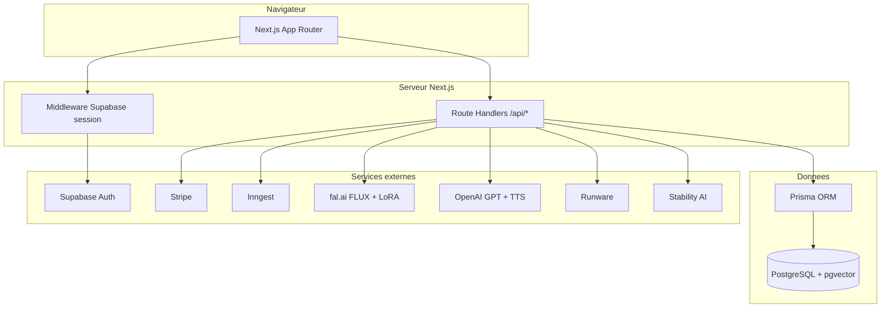
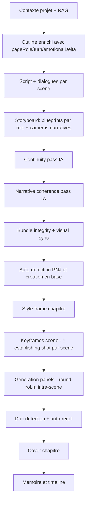

# Manga AI Studio

Plateforme web **studio IA** pour creer des series **manga / webtoon / roman graphique** avec **memoire narrative**, **direction artistique structuree**, **pipeline chapitre coherent** (anchors visuels, rythme manga, anti-duplication, drift detection) et **generation d'images multi-fournisseurs** (FLUX via fal, Runware, Stability, etc.).

Ce depot est un **monorepo** : site web Next.js, packages metier (IA, billing, moderation, workflows) et schema Prisma partages.

---

## Table des matieres

1. [Ce que fait le produit](#ce-que-fait-le-produit)
2. [Architecture technique](#architecture-technique)
3. [Pipeline chapitre V5](#pipeline-chapitre-v5)
4. [Logiciels, services et IA](#logiciels-services-et-ia)
5. [Structure du depot](#structure-du-depot)
6. [Installation et execution locale](#installation-et-execution-locale)
7. [Variables d'environnement](#variables-denvironnement)
8. [Base de donnees (Prisma)](#base-de-donnees-prisma)
9. [API et authentification](#api-et-authentification)
10. [Paiement et tokens](#paiement-et-tokens)
11. [Cout IA par chapitre](#cout-ia-par-chapitre)
12. [IA a brancher / feuille de route](#ia-a-brancher--feuille-de-route)

---

## Ce que fait le produit

### UX simplifiee (3 etapes)

1. **Creer le projet** : univers, pitch, genres, ton, style visuel (+ reglages fins optionnels)
2. **Creer les personnages** : fiche detaillee (sexe, apparence, traits, voix) + generation visuelle
3. **Generer un chapitre** : zone texte libre "Raconte ton chapitre" + rythme (Progressif / Intense / Explosif) → generation complete (scenario + images)

L'interface est pensee grand public : **aucun jargon technique** (pas de mention LoRA, FAL, Inngest, tokens, pipeline dans l'UI). Le technique tourne en arriere-plan.

### Features cles

- **Projets** : univers, pitch, genres, intensite de contenu, rating
- **Personnages** : fiches completes + Canon Pack (references visuelles). Champ `gender` (male/female) utilise dans les prompts IA
- **PNJ auto-generes** : les personnages non declares par l'user mais mentionnes dans l'histoire sont automatiquement crees en base (`autoGenerated: true`) et reutilises dans les chapitres suivants
- **Style pack** : parametres DA canoniques (rendu, trait, ombrage, contraste, camera, contraintes negatives)
- **Bible d'univers** : JSON structure (regles du monde, lore, themes) pour le RAG
- **Chapitres** : pipeline manga-first avec **anchors visuels**, **rythme kishoteketsu**, et **drift detection**
- **Images** : routage dynamique multi-backend (fal / BFL / Runware / Stability) avec **LoRA auto** + **IP-Adapter** + **keyframes scene**
- **Lecteur manga** : double page, navigation RTL, bascule texte/cases, cadrage intelligent (cover/contain dynamique)
- **Suite de chapitre** : instruction libre + tags rapides en fin de lecture
- **Moderation** : matrice intensite x fournisseur
- **Monetisation** : Stripe → wallet tokens avec ledger
- **Auth** : Supabase (email + mot de passe ou magic link), admins illimites pour QA

---

## Architecture technique



- **Frontend** : Next.js 15 (App Router), React 19, TypeScript strict, Tailwind CSS v4
- **UI** : composants shadcn (Radix UI, CVA, lucide-react)
- **Auth** : Supabase Auth + sync vers User Prisma. Mode dev sans Supabase via `AUTH_DISABLED=true`
- **Persistance** : PostgreSQL + Prisma + pgvector (RAG/memoire semantique)

---

## Pipeline chapitre V5

Le pipeline a ete entierement refonde pour maximiser la coherence visuelle et narrative.



### Rythme manga (kishoteketsu)

Chaque beat de l'outline a :
- `pageRole` : establishing / escalation / confrontation / revelation / aftermath / cliffhanger
- `turn` : micro-retournement unique
- `emotionalDelta` : variation -3 a +3

Regles strictes : pas 2 pageRoles identiques consecutifs, au moins 1 revelation et 1 aftermath par chapitre.

### Anchors visuels

- **Style frame** : 1 image ambiance/palette par chapitre (injectee comme ref dans toutes les keyframes)
- **Keyframes scene** : 1 establishing shot par scene (lieu + persos principaux + LoRA + environnement)
- **Injection** : chaque panel recoit la keyframe de sa scene comme reference (IP-Adapter ou LoRA+ref)

### Coherence personnages

- **Ref canon** : `CharacterVisualRef.isPrimary` (pas la derniere SceneImage du projet)
- **LoRA auto** : entrainement automatique en arriere-plan (non bloquant) des que 3+ visuels existent
- **LoRA + ref image** : FAL supporte simultanement LoRA et ref image (`image_url` + `strength`)
- **Drift detection** : scoring heuristique post-generation (traits, couleurs, genre) + auto-reroll (max 2 tentatives)

### Sequencement

Round-robin : sequentiel intra-scene (panel 1 puis 2 puis 3...) mais parallele inter-scenes. Cela garantit que les panels d'une meme scene partagent le meme contexte visuel.

---

## Logiciels, services et IA

| Categorie | Technologie | Role | Statut |
|-----------|-------------|------|--------|
| Runtime | **Node.js 20+** | Build et serveur | Actif |
| Monorepo | **pnpm** (workspaces) | Gestion packages | Actif |
| Framework | **Next.js 15** | UI, API, SSR | Actif |
| Styles | **Tailwind CSS v4** | Design system | Actif |
| BDD | **PostgreSQL + pgvector** | Donnees + RAG vectoriel | Actif |
| ORM | **Prisma** | Schema, client, migrations | Actif |
| Auth | **Supabase** | Sessions, email/password, magic link | Actif |
| Paiement | **Stripe** | Checkout packs tokens, webhooks | Actif |
| Jobs async | **Inngest** | Pipeline chapitre (optionnel, fallback sync) | Actif |
| **IA image principale** | **fal.ai** (FLUX dev, FLUX LoRA, FLUX Redux) | Panels, keyframes, covers, LoRA training | **Actif** |
| **IA image secondaire** | **Runware** | Adapter HTTP (CivitAI models) | **Partiel** (a valider en prod) |
| **IA image secondaire** | **Black Forest Labs** | Adapter HTTP (FLUX via BFL) | **Partiel** (a valider en prod) |
| **IA image fallback** | **Stability AI** | Stable Image Ultra (cover photoreal) | **Partiel** (a valider en prod) |
| **IA texte** | **OpenAI** (gpt-4o-mini) | Outline, dialogues, coherence, continuity | **Actif** |
| **IA embeddings** | **OpenAI** (text-embedding-3-small) | RAG / memoire semantique | **Actif** |
| **IA TTS** | **OpenAI** (audio/speech) | Text-to-Speech dialogues | **Route API prete, UI non branchee** |
| **IA traduction** | Module interne (prompt-translator) | FR->EN pour FLUX | **Actif** |

---

## Structure du depot

```
MYMANGA/
├── apps/web/                 # Site web Next.js (UI + API routes)
├── packages/
│   ├── ai/                   # Routage image, adapters, prompt composers, LoRA, TTS, drift detection
│   ├── billing/              # Stripe checkout, wallet, pricing
│   ├── config/               # Schema Zod des variables d'environnement
│   ├── core/                 # Modes de rendu, coherence, types partages
│   ├── db/                   # Prisma schema + client
│   ├── exports/              # Export PDF/ZIP (stub - a remplacer par vrai moteur)
│   ├── memory/               # RAG pgvector, embeddings, contexte projet, memoire chapitre
│   ├── moderation/           # Intensite contenu, matrice fournisseur
│   ├── ui/                   # Utilitaire cn (Tailwind merge)
│   └── workflow/             # Pipeline chapitre complet, Inngest, LoRA auto
├── DEPLOYMENT.md             # Guide Render, Supabase, Stripe, IA
├── render.yaml               # Blueprint Render
└── pnpm-workspace.yaml
```

---

## Installation et execution locale

```bash
pnpm install
pnpm db:generate
pnpm db:push
pnpm dev
```

| Commande | Description |
|----------|-------------|
| `pnpm dev` | Demarre apps/web en mode dev |
| `pnpm build` | Build production Next.js |
| `pnpm db:generate` | Prisma generate |
| `pnpm db:push` | Prisma db push |
| `pnpm db:studio` | Prisma Studio |
| `pnpm test` | Tests Vitest (packages/ai) |

---

## Variables d'environnement

Variables critiques :

- **`DATABASE_URL`** : PostgreSQL
- **`NEXT_PUBLIC_SUPABASE_URL`**, **`NEXT_PUBLIC_SUPABASE_ANON_KEY`** : auth
- **`FAL_KEY`** : generation images (obligatoire en prod)
- **`OPENAI_API_KEY`** : texte, coherence, embeddings, TTS
- **`STRIPE_SECRET_KEY`**, **`STRIPE_WEBHOOK_SECRET`** : paiement
- **`INNGEST_EVENT_KEY`** : jobs async (optionnel, fallback sync)
- **`ADMIN_UNLIMITED_EMAILS`** : comptes QA illimites (ex: `test@gmail.com`)
- **`STORAGE_BUCKET`** : bucket Supabase pour les images persistees

Optionnelles : `BFL_API_KEY`, `RUNWARE_API_KEY`, `STABILITY_API_KEY`, `POSTHOG_KEY`, `SENTRY_DSN`

Detail : **[DEPLOYMENT.md](./DEPLOYMENT.md)**

---

## Base de donnees (Prisma)

Schema : `packages/db/prisma/schema.prisma`

Modeles notables : `User`, `Project`, `Character` (avec `autoGenerated`, `gender`), `CharacterCanonPack`, `LoraModel`, `LoraAttachment`, `Chapter`, `ChapterScene`, `SceneImage` (avec `consistencyScore`, `renderingMode` incluant `SCENE_KEYFRAME` et `STYLE_FRAME`), `Wallet`, `Job`, `RagDocument` (pgvector)

---

## API et authentification

Routes principales :

| Methode | Chemin | Role |
|---------|--------|------|
| GET/POST | `/api/projects` | Liste / creation projets |
| GET/PATCH/DELETE | `/api/projects/[id]` | Detail / mise a jour / archivage |
| GET/POST | `/api/projects/[id]/characters` | Personnages |
| GET/PATCH | `/api/characters/[characterId]` | Fiche personnage |
| POST | `/api/characters/[characterId]/generate-visual` | Generation visuelle |
| POST | `/api/characters/[characterId]/train-lora` | Entrainement LoRA |
| POST | `/api/projects/[id]/pipeline` | Lancement pipeline chapitre |
| GET | `/api/projects/[id]/chapters/[chapterId]` | Detail chapitre + scenes + images |
| POST | `/api/projects/[id]/chapters/[chapterId]/continue` | Suite chapitre |
| POST | `/api/scene-images/[sceneImageId]/retry` | Retry image (avec LoRA/refs reconstitues) |
| POST | `/api/tts` | Text-to-Speech |
| POST | `/api/ai/generate` | Generation image unitaire |
| GET | `/api/wallet` | Solde wallet |
| POST | `/api/billing/checkout-session` | Stripe Checkout |

---

## Paiement et tokens

- **Tokens** = unite metier ; **wallet** + **ledger** = source de verite
- Achat Stripe credite le wallet ; generation debite via `reserveTokens`
- Admins dans `ADMIN_UNLIMITED_EMAILS` ont un wallet auto-recharge (999 999 tokens)

---

## Cout IA par chapitre

Pour **1 chapitre** (~10 pages, 4-6 panels/page) :

| Poste | Hypothese | Cout approx. |
|------|-----------|--------------|
| Images panels (40-60) | 512x768 via fal flux/dev | ~0.39-0.59 USD |
| Style frame | 1 image | ~0.01 USD |
| Keyframes scene | 10 images | ~0.10 USD |
| Cover | 1 image 768x1024 | ~0.02 USD |
| Auto-reroll drift | ~2% panels | ~0.01 USD |
| Texte (outline + dialogues + passes) | gpt-4o-mini | ~0.02-0.05 USD |
| Embeddings | text-embedding-3-small | ~0.001 USD |
| **Total chapitre** | | **~0.55-0.78 USD** |

---

## IA a brancher / feuille de route

### A brancher

| Service | Etat | Action |
|---------|------|--------|
| **TTS (Text-to-Speech)** | Route API prete (`POST /api/tts`), UI lecteur non branchee | Ajouter bouton lecture audio dans le manga reader |
| **Adapters Runware / BFL / Stability** | Code HTTP present, non valides en prod | Tester avec comptes reels, aligner endpoints/modeles |
| **Export PDF** | Stub (texte seulement) | Remplacer par vrai moteur PDF (pdfkit, puppeteer, etc.) |

### Deja fonctionnel

- fal.ai (FLUX dev + FLUX LoRA + FLUX Redux + training LoRA)
- OpenAI (outline, dialogues, coherence, continuity, embeddings)
- LoRA auto-training (non bloquant, en arriere-plan)
- Drift detection + auto-reroll
- Anchors visuels (style frame + keyframes scene)
- PNJ auto-generes avec recurrence narrative de base
- RAG pgvector (si OPENAI_API_KEY + pgvector actif)
- Lecteur manga + mode webtoon vertical
- Stripe + wallet

### Etat actuel des briques "coherence avancee"

Les gros travaux pousses le `2026-04-07` sont **toujours dans le code**. Pendant les debugs suivants, on a surtout touche a la robustesse de generation FAL, au proxy d'images et au reader, **sans retirer les briques coeur de coherence**.

#### Actif et branche en prod

- **CharacterFingerprint**
  - type + schema Prisma presents
  - extraction auto apres `generate-visual`
  - persistance sur `Character.characterFingerprint`
  - reinjection dans les prompts image du pipeline
- **Validation post-generation**
  - `validateGeneratedPanel` + `scoreCharacterConsistency`
  - utilise dans le pipeline principal
  - utilise aussi dans la route retry d'image
- **SceneState**
  - construit dans le pipeline
  - persiste en base via `persistSceneState`
  - resolution des personnages en IDs + anchors de scene plus fiables
- **PanelContract**
  - construit avant la generation d'image
  - persiste dans les metadata des panels
  - alimente `renderMeta` / `layoutMeta` pour le reader
- **BeatAdvancement**
  - analyse de repetitivite branchee dans la construction des beats
  - correction automatique simple des beats trop stagnants
- **Verrouillage personnage**
  - prompts personnage enrichis avec contraintes canoniques
  - prompts panel renforces avec fingerprint + drift rules + continuity prompts
- **Reader / proxy images**
  - support des URLs proxifiees
  - support `renderMeta` / `layoutMeta` conserve
  - mode webtoon vertical disponible
  - retry/statuts/debug conserves dans le reader

#### Present dans le code mais encore partiel / non totalement branche

- **SceneExtrasRegistry**
  - module present
  - persistance reelle DB pas encore faite
  - une partie reste en `TODO` / fallback memoire
- **PNJ / extras persistants**
  - les PNJ auto-crees sont mieux injectes dans l'histoire et le prompt
  - la couche "extras de decor persistants par lieu/scene" reste a terminer proprement en DB
- **Fingerprint visuel**
  - l'extraction actuelle reste heuristique
  - une vraie analyse Vision renforcerait encore la precision

#### Important

- Les derniers debugs ont surtout corrige :
  - la surcharge FAL (`429 concurrent_requests_limit`)
  - les timeouts / aborts
  - l'affichage des images dans le reader
- Ils **n'ont pas supprime** :
  - `CharacterFingerprint`
  - la validation stricte post-generation
  - `SceneState`
  - les types/exports coeur ajoutes lors du gros chantier
- Plusieurs briques "bloc 2/3" sont maintenant branchees dans le flux principal, mais les PNJ/extras persistants et l'extraction visuelle profonde restent les deux chantiers principaux a finir.

### Ameliorations futures

- **Rate limiting prod** : Upstash pour multi-instances (actuellement en memoire)
- **RAG** : durcir pgvector, migrations propres, monitoring queries
- **Vision API** : scoring visuel par vision (CLIP) au lieu de heuristique texte
- **Multi-agents** : orchestration LLM plus poussee pour la generation de scenario
- **SceneExtrasRegistry persistant** : vrai stockage DB pour la reutilisation fiable des PNJ/extras
- **Vision fingerprint** : extraction robuste depuis images de reference pour verrouiller encore mieux les personnages
- **Webtoon polish** : raffinements UI/UX du scroll vertical, espacements et rythme mobile

---

*README Manga AI Studio — pipeline V5 avec validation personnage, scene state, panel contracts, PNJ narratifs et reader manga/webtoon robuste.*
