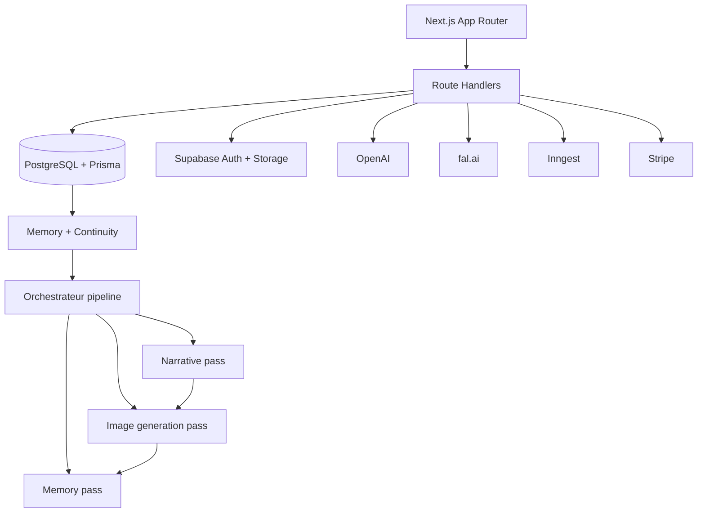

# Manga AI Studio

Monorepo full-stack pour generer des chapitres manga/webtoon coherents avec memoire narrative, canon visuel, PNJ adaptatifs et generation multi-provider.

## Parcours principal

1. Creer un projet (pitch, genre, ton, style pack)
2. Definir personnages, style et univers
3. Creer un chapitre dans le studio 4 etapes (Brief → Casting → Plan → Generation)
4. Lire en manga pagine ou en webtoon vertical
5. Continuer la serie en gardant le canon

## Fonctionnalites

### Projets
- Pitch, genres, intensite, bible d'univers, style pack
- Curseurs creatifs (violence, romance, noirceur, realisme, rythme…)
- Navigation : Overview, Bible, Characters, Canon, Style visuel, Chapters, Pipeline, Assets, Settings, History

### Personnages
- Fiches completes avec refs visuelles, preview et fingerprint
- Prompts verrouilles via canon pack
- Preview IA et generation visuelle automatique

### Chapitres — Studio 4 etapes
- **Brief** : pitch, conflit principal, mode expert/simple (mode simple par defaut pour le chapitre 1)
- **Casting & Canon** : selection heros/antagonistes, decor principal, PNJ libres avec resolution IA
- **Plan** : contrat narratif, outline editoriale, outline de production, plan de production
- **Generation & Review** : pipeline complet, suivi temps reel, QA, rerolls

### PNJ & Creatures
- 35+ archetypes NPC (mentor, villain, rival, oracle, berserker, informateur, ghost…)
- 15+ creatures (dragon, oni, shinigami, golem, kaiju, spectre, familier, symbiote…)
- Moteur de resolution adaptatif : catalogue local + generation IA
- Endpoint API `/api/projects/[id]/npc-resolve`

### Pipeline chapitre (3 passes modulaires)
- Orchestrateur mince (~220 lignes) : setup DB → 3 appels sequentiels
- **Narrative pass** (~1730 lignes) : contexte projet, bundle (outline + script + storyboard), coherence, persistance scenes, continuity engine
- **Image generation pass** (~1430 lignes) : boucle FAL, retry policy, shot compliance, coverage, recovery, cover art, quality report
- **Memory pass** (~200 lignes) : canon warnings, snapshot, memoire persistante, continuity diff, finalisation job
- Outline structuree avec arc promises, world consequences, setup/payoff hooks
- 21 types de beats narratifs (setup, escalation, villain_introduction, flashback_trigger, body_horror_reveal…)
- Modes narratifs : linear, flashback_framed, flash_forward_framed, in_medias_res
- 16 modes de genre (shonen_combat, seinen_tension, dark_fantasy_gore, josei_adult, comedy_parody…)
- Anti-repetition : detection de similarite, phases narratives distinctes pour les beats generes
- Story quality gate : cliffhanger, micro-turns, payoff, respiration, variete de beats
- Directives gore conditionnelles pour dark fantasy

### Lecteur
- Manga pagine (simple/double page) et webtoon vertical
- TTS : bouton ecouter global + lecture inline des dialogues
- Debug panel : provider, workflow, reference policy, complexite, rerolls, findings vision
- Proxy image, URLs signees, retries d'images

### Images & Vision QA
- Provider principal : fal.ai (FLUX dev, LoRA, Redux)
- Secondaires : Runware, BFL, Stability
- Routing scene-first avec `subjectFocus` du blueprint (hero, npc, enemy, environment, group) prioritaire sur les heuristiques
- `crowdCritical` route vers `CHARACTER_IN_SCENE` (pas `ESTABLISHING_ENVIRONMENT`)
- Vision QA auto-activee sur panels critiques, throttle 80 appels/min
- Rerolls cibles : decor, fidelite personnage, interaction (seulement si vision QA executee), style, composition
- Detection effets magiques : signaux FR/EN dans le fact extractor, section dediee dans le prompt composer (pouvoir, gardienne, eveil, revelation…)
- Drift detector : word-boundary matching pour eviter les faux positifs de genre
- Log `[fal:routing]` pour tracer subjectFocus → panelCategory sur chaque panel
- Contenu mature/adulte : `safety_tolerance: "6"` sur FAL, modele `flux-realism` pour ADULT_EXPLICIT, negative prompt adaptatif par layer

### Autofill IA
- Completion automatique des champs manquants du studio
- Mode brief (genere le pitch) et mode all_missing (complete tout)
- Detection et message adapte pour les erreurs reseau/parsing

## Architecture



Stack :

- Frontend : Next.js 15, React 19, Tailwind v4, shadcn
- Backend : route handlers Next.js + packages TypeScript
- Data : PostgreSQL, Prisma, pgvector
- Auth/Storage : Supabase
- Orchestration : Inngest avec fallback synchrone
- Texte : OpenAI
- Image : fal principal, Runware/BFL/Stability secondaires

## Structure du depot

```text
MYMANGA/
├── apps/web/                   # App Next.js, UI et routes API
├── packages/ai/                # Prompts, image routing, QA vision, fingerprints, genre director
├── packages/workflow/          # Pipeline chapitre (orchestrateur + 3 passes modulaires)
├── packages/world/             # SceneBlueprint, ontologies NPC/creatures, NPC resolver
├── packages/continuity/        # Canon, snapshots, diff, validation
├── packages/memory/            # RAG, scene extras, memoire persistante
├── packages/core/              # Types partages et contrats
├── packages/db/                # Schema Prisma
├── packages/billing/           # Stripe, wallet, ledger
├── packages/moderation/        # Garde-fous contenu/provider
├── packages/config/            # Configuration partagee
├── packages/exports/           # Export manga/PDF
├── packages/ui/                # Composants UI partages
├── docs/                       # Architecture et glossaire routes
└── render.yaml                 # Blueprint Render
```

## Routes principales

| Route | Role |
|---|---|
| `/projects/[id]` | Hub projet (overview, tuiles, arcs, chapitres recents) |
| `/projects/[id]/style` | Configuration style visuel |
| `/projects/[id]/pipeline` | Pipeline de generation (ex /generate) |
| `/projects/[id]/chapters/[id]/edit` | Studio chapitre 4 etapes |
| `/projects/[id]/chapters/[id]/generate` | Suivi temps reel de la generation |
| `/projects/[id]/chapters/[id]/read` | Lecteur manga/webtoon |
| `/projects/[id]/chapters/[id]/review` | Review QA |
| `/projects/[id]/studio` | Redirect vers le dernier chapitre |

## API principale

| Methode | Route | Role |
|---|---|---|
| `GET/POST` | `/api/projects` | Projets |
| `GET/POST` | `/api/projects/[id]/characters` | Personnages |
| `POST` | `/api/characters/[id]/generate-visual` | Preview visuel personnage |
| `POST` | `/api/projects/[id]/chapters` | Brouillon chapitre |
| `POST` | `/api/projects/[id]/pipeline` | Lancer pipeline |
| `POST` | `/api/projects/[id]/npc-resolve` | Resolution PNJ (catalogue + IA) |
| `POST` | `/api/projects/[id]/chapters/[id]/autofill` | Completion IA |
| `POST` | `/api/projects/[id]/chapters/[id]/launch` | Lancer generation chapitre |
| `GET` | `/api/projects/[id]/chapters/[id]` | Data reader + debug |
| `POST` | `/api/scene-images/[id]/retry` | Reroll image |
| `POST` | `/api/tts` | Text-to-speech |
| `GET` | `/api/diagnostics/public` | Checks prod sans secrets |

## Installation locale

```bash
pnpm install
pnpm db:generate
pnpm db:push
pnpm dev
```

Commandes utiles :

| Commande | Role |
|---|---|
| `pnpm dev` | Lance le site |
| `pnpm build` | Build prod |
| `pnpm db:generate` | Prisma generate |
| `pnpm db:push` | Sync schema |
| `pnpm db:studio` | Prisma Studio |
| `pnpm --filter @manga-ai-studio/ai test` | Tests IA |
| `pnpm --filter @manga-ai-studio/workflow test` | Tests workflow |
| `pnpm --filter @manga-ai-studio/world test` | Tests QA world |
| `pnpm --filter @manga-ai-studio/web build` | Build app web |

## Variables d'environnement

Critiques :

- `DATABASE_URL`
- `NEXT_PUBLIC_SUPABASE_URL`
- `NEXT_PUBLIC_SUPABASE_ANON_KEY`
- `SUPABASE_SERVICE_ROLE_KEY`
- `STORAGE_BUCKET`
- `FAL_KEY`
- `OPENAI_API_KEY`
- `STRIPE_SECRET_KEY`
- `STRIPE_WEBHOOK_SECRET`
- `NEXT_PUBLIC_APP_URL`
- `INNGEST_EVENT_KEY`
- `INNGEST_SIGNING_KEY`

Optionnelles :

- `BFL_API_KEY`
- `RUNWARE_API_KEY`
- `STABILITY_API_KEY`
- `ADMIN_UNLIMITED_EMAILS`
- `POSTHOG_KEY`
- `SENTRY_DSN`
- `OPENAI_VISION_MODEL`
- `ENABLE_PREMIUM_VISION_QA`
- `ENABLE_CHARACTER_VISION_FINGERPRINT`

Dev local minimal :

```env
AUTH_DISABLED=true
DATABASE_URL=postgresql://...
NEXT_PUBLIC_SUPABASE_URL=...
NEXT_PUBLIC_SUPABASE_ANON_KEY=...
```

Ne jamais laisser `AUTH_DISABLED=true` en production.

## Deploiement Render

Build command :

```bash
npm install -g pnpm@10.33.0 && pnpm install --frozen-lockfile && pnpm --filter @manga-ai-studio/db exec prisma generate && pnpm --filter @manga-ai-studio/web build
```

Start command :

```bash
pnpm --filter @manga-ai-studio/web start
```

Checklist :

1. Renseigner toutes les variables critiques
2. Verifier `NEXT_PUBLIC_APP_URL`
3. Ne pas definir `AUTH_DISABLED`
4. Executer `pnpm --filter @manga-ai-studio/db exec prisma db push`
5. Verifier `GET /api/diagnostics/public`
6. Confirmer `hasFalKey=true`, `hasOpenAI=true`, `authDisabled=false`
7. Lancer un chapitre test

## Base de donnees

Schema : `packages/db/prisma/schema.prisma`

Modeles principaux : Project, Character, Chapter, ChapterScene, SceneImage, MemorySnapshot, Job, RagDocument, Wallet, NpcCanonPack, CharacterPropInventory

## Paiement et tokens

- Stripe alimente le wallet
- Le wallet et le ledger sont la source de verite
- Les comptes admin QA peuvent etre illimites

## Cout IA par chapitre

Ordre de grandeur pour un chapitre premium de 10 pages :

| Poste | Hypothese | Cout approx. |
|---|---|---|
| Panels | 40-60 images 768x1024 via fal | ~0.58-0.95 USD |
| Style frame + keyframes + cover | Refs et couverture | ~0.13 USD |
| Rerolls QA | Decor / interaction / drift | ~0.03-0.10 USD |
| Texte + embeddings | Outline, dialogues, passes, memoire | ~0.03-0.06 USD |
| **Total** | Pipeline complet | **~0.77-1.24 USD** |

## Statuts de generation

- `FULLY_OPERATIONAL`
- `DEGRADED_NO_OPENAI` (Service d'ecriture indisponible)
- `DEGRADED_NO_IMAGE_PROVIDER` (Service d'image indisponible)
- `DEGRADED_STORAGE_MISSING`
- `DEGRADED_DIALOGUE_FALLBACK`
- `DEGRADED_OUTLINE_FALLBACK`

Un chapitre degrade sort en `partial_success`.
