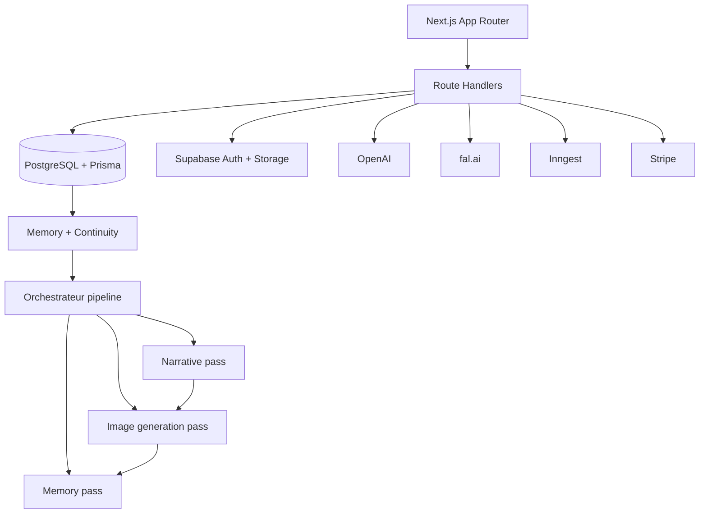

# Manga AI Studio

Monorepo full-stack pour creer un manga ou un webtoon avec un studio editorial, un pipeline premium v3 pilote par IA, une couche de compatibilite legacy encore active sur certaines surfaces, et une stack image centree sur FAL.

## Ce que fait le produit

Le produit permet a un auteur de :

1. creer un projet manga ou webtoon ;
2. definir un ton, un style visuel, des personnages et des lieux ;
3. preparer un chapitre dans un studio en 4 etapes ;
4. obtenir un plan premium de 70 a 75 panels ;
5. lancer une generation complete ;
6. relire, reroll, valider puis lire le chapitre final.

Le coeur du systeme est simple a formuler :

- l'utilisateur ne demande pas "une image", il demande "un chapitre lisible, coherent, style-respecting" ;
- le cerveau IA transforme cette demande en contrats successifs de plus en plus concrets ;
- l'image n'est que la derniere etape.

## Parcours utilisateur

### 1. Creer le projet

L'utilisateur renseigne :

- le pitch ;
- le genre principal et les sous-genres ;
- le ton ;
- le format `manga` ou `webtoon` ;
- le style visuel ;
- les contraintes de contenu ;
- un style pack optionnel ou derive.

Le projet est persiste dans la base puis enrichi par des surfaces comme :

- `/api/projects`
- `/api/projects/[id]`
- `/api/projects/[id]/style-pack`
- `/api/projects/[id]/pipeline-version`

### 2. Definir le canon

L'utilisateur construit le socle de coherence :

- personnages ;
- refs visuelles ;
- canon packs ;
- lieux ;
- bible d'univers ;
- relations ;
- PNJ recurrents.

APIs principales :

- `/api/projects/[id]/characters`
- `/api/characters/[characterId]`
- `/api/characters/[characterId]/generate-visual`
- `/api/characters/[characterId]/train-lora`
- `/api/projects/[id]/recurring-npcs`
- `/api/projects/[id]/npc-resolve`
- `/api/projects/[id]/relationships`
- `/api/projects/[id]/canon-health`

### 3. Preparer le chapitre dans le studio

Le studio chapitre est pense comme une machine a contrat.

Etapes :

1. `Brief` : intention auteur, resume, cliffhanger cible.
2. `Casting & Canon` : selection des personnages, lieux, refs.
3. `Plan` : outline approuve, production outline, production plan.
4. `Generation & Review` : lancement, suivi job, QA, rerolls, validation.

API centrale :

- `GET/PATCH /api/projects/[id]/chapters/[chapterId]/studio`

Cette route hydrate un snapshot riche qui fusionne :

- le chapitre ;
- le projet ;
- le canon projet ;
- les canons personnages ;
- les canons lieux ;
- le readiness report ;
- les stats de generation en cours.

### 4. Estimer avant de lancer

Avant la generation, l'utilisateur ou le studio demande un estimate premium :

- `POST /api/projects/[id]/chapters/estimate`

Cette route :

- produit ou relit l'outline approuve ;
- construit un `productionOutline` ;
- construit des `panelBlueprints` premium ;
- densifie de maniere deterministe pour rester dans la range `70-75` ;
- calcule des budgets de focus, des scores de readiness et des blockers editoriaux.

### 5. Lancer la generation

Le lancement premium se fait par :

- `POST /api/projects/[id]/chapters/[chapterId]/launch`

La route :

- verifie l'auth ;
- applique les gardes age-gate ;
- relit le snapshot studio ;
- refuse si le contrat premium est incomplet ;
- bloque les plans monotones ou heros-centres ;
- cree un job ;
- enfile ensuite la pipeline.

Une ancienne route existe encore pour un flow plus legacy :

- `POST /api/projects/[id]/pipeline`

### 6. Suivre le job, lire et corriger

APIs de lecture et de pilotage :

- `GET /api/jobs/[jobId]`
- `GET /api/projects/[id]/chapters/[chapterId]`
- `POST /api/scene-images/[sceneImageId]/retry`
- `POST /api/scene-images/[sceneImageId]/validate`
- `GET /api/scene-images/[sceneImageId]/debug`
- `GET /api/projects/[id]/chapters/[chapterId]/qa-report`

Le reader et les surfaces de review consomment :

- les `SceneImage` ;
- les metadonnees de prompts ;
- les traces FAL ;
- le `canonicalPacket` quand il existe ;
- les scores QA et les raisons de rejet.

## Comment le cerveau fonctionne

## Vue d'ensemble

Le cerveau est aujourd'hui compose de deux mondes :

1. un chemin premium v3 strict ;
2. une couche legacy encore necessaire sur certaines surfaces historiques.

Le coeur du refactor recent est :

- `packages/workflow/src/run-full-chapter-pipeline.ts` : orchestrateur mince ;
- `packages/workflow/src/run-premium-v3-pipeline.ts` : cerveau premium v3 strict ;
- `packages/workflow/src/legacy/run-legacy-compatible-chapter-pipeline.ts` : pont de compatibilite legacy ;
- `packages/workflow/src/chapter-style-bible-resolver.ts` : source de verite style v3.

## Pipeline premium v3

Le premium v3 suit la chaine :

1. IA1 `Story Architect`
2. IA2 `Manga Editor / Storyboard Director`
3. IA3 `Panel Renderer`

Contrats principaux :

- `StoryArc`
- `StoryboardPlan`
- `PanelRenderSpec`
- `ChapterStyleBible`
- `ChapterVisualMemory`
- `FalRenderRoute`

### IA1 - Story Architect

Implementation :

- `packages/workflow/src/passes/story-pass.ts`
- `packages/ai/src/agents/story-architect-agent-llm.ts`

Role :

- transformer l'intention auteur en arc de chapitre concret ;
- sortir `6-10` beats ordonnes ;
- expliciter `storyEvent`, `emotion`, `dangerLevel`, `continuityEffects`, `chapterGoal`, `cliffhanger`.

Rappels importants :

- en premium-only, le stub est interdit ;
- `OPENAI_API_KEY` devient obligatoire ;
- le systeme refuse les combats inventes ;
- le systeme refuse les personnages ou lieux hors fiche projet ;
- le cliffhanger doit etre racine dans les beats, pas ajoute artificiellement.

Modele par defaut :

- `STORY_ARCHITECT_MODEL` sinon `gpt-4o-mini`

### IA2 - Manga Editor / Storyboard Director

Implementation :

- `packages/workflow/src/passes/storyboard-pass.ts`
- `packages/ai/src/agents/manga-editor-agent-llm.ts`

Role :

- transformer le `StoryArc` en `StoryboardPlan` ;
- definir les pages, panels, layouts, `renderMode`, `shotType`, `subjectFocus`, `cutawayType`, `cameraAngle`, `dialogue`, `mustShow`, `mustNotShow`.

Rappels importants :

- l'IA2 ne doit jamais ecrire de prompts image ;
- elle ne doit jamais reinventer le lore ou la dramaturgie ;
- elle cible `70-75` panels ;
- elle impose de la variete ;
- chaque panel doit etre lie a un `sourceBeatId` valide.

Le `storyboard-pass` ajoute des garde-fous supplementaires :

- densification deterministe si le plan natif est hors range ;
- anti hero overload ;
- anti closeup overload ;
- anti repetition de signatures visuelles ;
- validation stricte du storyboard.

### IA3 - Panel Renderer

Implementation :

- `packages/workflow/src/passes/render-pass.ts`
- `packages/ai/src/services/render-spec-builder.ts`
- `packages/ai/src/services/minimal-panel-prompt-builder.ts`
- `packages/ai/src/services/fal-render-route-v3.ts`
- `packages/workflow/src/passes/default-panel-image-generator.ts`

Role :

- prendre le storyboard comme source de verite ;
- construire un `PanelRenderSpec` pour chaque panel ;
- valider refs + visibilite + contraintes ;
- construire un prompt minimal, court et non contradictoire ;
- resoudre une route FAL deterministe ;
- rendre les images ;
- persister le resultat et la QA.

Sequence stricte :

1. `buildPanelRenderSpec`
2. `assertValidRenderSpec`
3. `buildMinimalPanelPromptStrict`
4. `resolveFalRenderRoute`
5. `generatePanelImage`
6. panel QA + page QA + persistence

## Ce qui reste legacy

Le chemin legacy n'est pas mort, il est encapsule.

Il passe aujourd'hui par :

- `packages/workflow/src/legacy/run-legacy-compatible-chapter-pipeline.ts`
- `packages/workflow/src/passes/narrative-pass.ts`
- `packages/workflow/src/passes/image-generation-pass.ts`
- `packages/workflow/src/passes/memory-pass.ts`

Ce chemin :

- produit un `chapterImagePlan` ;
- construit des `CanonicalImagePromptPacket` quand possible ;
- sait encore retomber sur certains prompts legacy sur des chapitres historiques ;
- alimente les rerolls, la review et certains readers existants.

En clair :

- le premium v3 strict existe ;
- la convergence complete n'est pas terminee partout ;
- le repo est dans un etat de cohabitation controlee, pas encore dans un hard switch total.

## Architecture technique

## Packages principaux

- `apps/web` : UI, routes API Next.js, studio, reader, review
- `packages/workflow` : orchestration pipeline, passes, persistence, bridges
- `packages/ai` : agents, contrats IA, prompt builders, routage FAL, validators
- `packages/core` : types centraux, enums, contrats canoniques, range premium
- `packages/billing` : estimation des tokens et regles de pricing
- `packages/db` : Prisma, schema, migrations
- `packages/memory` : contexte et snapshots memoire
- `packages/continuity` : diffs et coherence narrative
- `packages/world` : resolution PNJ, univers, compatibilites

## Persistance

Stack de persistance :

- Prisma pour les entites produit ;
- Supabase pour le stockage image ;
- `SceneImage.metadata` pour l'audit prompt/runtime ;
- `FalTrace` pour les traces provider ;
- snapshots studio dans `chapter.outline`.

Surfaces de persistence importantes :

- `StoryArc` sauvegarde via `story-pass`
- `StoryboardPlan` sauvegarde via `storyboard-pass`
- `renderResultV2` sauvegarde via `render-pass`
- `SceneImage` et `metadata.canonicalPacket` sauvegardes dans le chemin legacy/canonique

## Feature flags et execution

Flags critiques :

- `PIPELINE_V3_STORYBOARD=true`
- `PIPELINE_V3_PREMIUM_ONLY=true`
- `PIPELINE_V3_RENDER_FAL=true`
- `PIPELINE_V3_STORY_ARCHITECT_LLM=true`
- `PIPELINE_V3_MANGA_EDITOR_LLM=true`
- `MANGA_ALLOW_BLUEPRINT_EXPANSION_LEGACY=true` uniquement pour debug/tests/support legacy

Secrets critiques :

- `OPENAI_API_KEY`
- `FAL_KEY`
- credentials Prisma / DB
- credentials Supabase

## Contrats de donnees a connaitre

### `StoryArc`

Contrat narratif de haut niveau :

- beats ;
- objectifs ;
- cliffhanger ;
- personnages presents ;
- effets de continuite ;
- dangers.

### `StoryboardPlan`

Contrat editorial visuel :

- pages ;
- layouts ;
- panels ;
- `renderMode` ;
- `shotType` ;
- `subjectFocus` ;
- `cutawayType` ;
- `dialogue` ;
- `mustShow` / `mustNotShow`.

### `PanelRenderSpec`

Contrat de rendu strict :

- personnages visibles ;
- refs images ;
- `dialogueIntent` ;
- style bible ;
- continuity locks ;
- contraintes negatives ;
- anchors.

### `ChapterStyleBible`

Contrat de style v3 derive du projet + style pack :

- `artStyle`
- `palette`
- `inking`
- `screentoneIntensity`
- `lineWeightHint`
- `backgroundDensity`
- `forbiddenStyleKeywords`

### `CanonicalImagePromptPacket`

Contrat canonique de generation d'image du chemin de convergence :

- contexte chapitre/scene/beat ;
- personnages ;
- props ;
- groupes ;
- dialogue ;
- style manga ;
- prompt structure FR + EN ;
- negative prompt ;
- provider payload ;
- reroll plans ;
- validation.

## Par quelles APIs ca passe

## Routes coeur produit

### Projet et canon

- `POST /api/projects`
- `GET/PATCH /api/projects/[id]`
- `POST /api/projects/[id]/style-pack`
- `GET/POST /api/projects/[id]/characters`
- `POST /api/characters/[characterId]/generate-visual`
- `POST /api/characters/[characterId]/train-lora`
- `POST /api/projects/[id]/npc-resolve`

### Studio chapitre

- `GET/PATCH /api/projects/[id]/chapters/[chapterId]/studio`
- `POST /api/projects/[id]/chapters`
- `GET/PATCH /api/projects/[id]/chapters/[chapterId]`
- `POST /api/projects/[id]/chapters/estimate`
- `POST /api/projects/[id]/chapters/[chapterId]/launch`
- `POST /api/projects/[id]/pipeline`

### Execution et suivi

- `GET /api/jobs/[jobId]`
- `POST /api/jobs/[jobId]/run-now`
- `POST /api/jobs/[jobId]/cancel`

### Review, QA, lecture

- `GET /api/projects/[id]/chapters/[chapterId]`
- `GET /api/projects/[id]/chapters/[chapterId]/qa-report`
- `POST /api/scene-images/[sceneImageId]/retry`
- `POST /api/scene-images/[sceneImageId]/validate`
- `GET /api/scene-images/[sceneImageId]/debug`
- `GET /api/images/proxy`

## Flux API recommande pour un chapitre premium

1. creer le projet ;
2. creer personnages + style pack ;
3. hydrater le studio via `GET /studio` ;
4. patcher le studio via `PATCH /studio` ;
5. appeler `POST /chapters/estimate` ;
6. verifier le readiness ;
7. appeler `POST /chapters/[chapterId]/launch` ;
8. suivre `GET /jobs/[jobId]` ;
9. lire le chapitre via `GET /chapters/[chapterId]` ;
10. reroll si besoin via `POST /scene-images/[sceneImageId]/retry`.

## Comment les IA sont promptes

## IA1 - Story Architect

Le prompt systeme impose notamment :

1. ne jamais inventer de personnages, creatures, lieux ou props hors fiche projet ;
2. ne jamais inventer de combat, feu, explosion ou letalite absente de l'intention ;
3. donner a chaque beat un `storyEvent` concret ;
4. garder des `continuityEffects` honnetes ;
5. produire une `emotionalTurn` courte ;
6. calibrer `dangerLevel` sur l'action reelle ;
7. ancrer le cliffhanger dans la fin du chapitre.

Le prompt user injecte :

- numero de chapitre ;
- titre ;
- summary ;
- user intent ;
- personnages autorises ;
- lieux connus ;
- schema JSON cible.

Le resultat est force en `json_object`, puis sanitize.

## IA2 - Manga Editor / Storyboard Director

Le prompt systeme impose notamment :

1. ne jamais ecrire de prompt image ;
2. ne jamais inventer de lore ;
3. ne jamais inventer un combat absent des beats ;
4. lier chaque panel a un beat valide ;
5. viser `70-75` panels ;
6. imposer une variete de plans ;
7. reserver au moins `10%` a de la respiration ;
8. utiliser des render modes adequats pour dialogue et reveal ;
9. faire correspondre layout et nombre de panels.

Le prompt user injecte :

- summary ;
- goal ;
- cliffhanger ;
- hero IDs ;
- target panels ;
- guideline `manga` vs `webtoon` ;
- liste complete des beats ;
- enums fermes autorises ;
- schema JSON strict attendu.

## IA3 - Prompting image premium v3

Le prompting image premium v3 suit une regle cle :

- l'IA3 ne recoit pas un "roman", elle recoit un contrat.

Le `minimal-panel-prompt-builder` construit un prompt anglais court a partir de blocs :

- `SUBJECT`
- `ENVIRONMENT`
- `SHOT`
- `ACTION`
- `STYLE`
- `NEGATIVE`

Proprietes importantes :

- cible de longueur `700-1200` caracteres ;
- anglais direct ;
- interdictions par `renderMode` ;
- integration du `dialogueIntent` comme sous-texte visuel ;
- reinjection explicite des `mustShow` du panel dans le bloc `ACTION` ;
- reinjection explicite des `continuityLocks.environmentLocks` dans le bloc `ENVIRONMENT` ;
- interdiction du texte dans l'image ;
- refus des contradictions type closeup hero dans un establishing.

Le `render-spec-builder` injecte :

- les personnages visibles ;
- les refs character/environment/panel/style ;
- la `dialogueIntent` ;
- les locks de continuite ;
- les contraintes `mustShow` et `mustNotShow`.

Le `render-spec-validator` et les assertions du render pass bloquent :

- closeups sans face refs dediees ;
- render modes invalides ;
- panels dialogue sans assez de personnages ;
- hero/support sans politique de references cohérente ;
- prompts contradictoires.

## Prompting canonique legacy->convergence

Le chemin canonique issu du legacy passe par :

- `packages/workflow/src/canonical-packet-bridge.ts`
- `packages/ai/src/services/canonical-prompt-recipe-builder.ts`

Il produit :

- des sections structurees ;
- un prompt FR structure ;
- un prompt EN structure ;
- un negative prompt EN ;
- un `providerPayload` reconciliable avec le runtime.

Regle dure :

- chaque prompt canonique contient toujours la notion de `manga visual language`.

## Routage image vers FAL

Le premium v3 ne route plus avec des heuristiques textuelles.

Il route depuis `renderMode` uniquement via `packages/ai/src/services/fal-render-route-v3.ts`.

Exemples :

- `establishing_environment` -> environnement, `LIGHT`, paysage
- `dialogue_two_shot` -> dialogue, `STRONG`, carre
- `hero_closeup` -> personnage, `STRONG`, portrait
- `insert_object` -> insert, `LIGHT`, carre
- `combat_exchange` -> combat, `STRONG`, paysage

Model IDs symboliques utilises par le routeur :

- `fal-panel-character-v3`
- `fal-panel-environment-v3`
- `fal-panel-insert-v3`
- `fal-panel-group-v3`
- `fal-panel-combat-v3`
- `fal-panel-dialogue-v3`
- `fal-panel-creature-v3`
- `fal-panel-threat-v3`

Le branchement runtime reel vers FAL se fait ensuite via :

- `packages/workflow/src/passes/default-panel-image-generator.ts`

Ce generateur appelle l'adapter FAL en :

- `mode: PANEL_FINAL`
- avec refs flatten ;
- avec refs `character/environment/panel/style` aplaties puis envoyees reellement au provider ;
- dimensions derivees du `sizePreset` ;
- `skipPromptTranslation: true` pour ne pas polluer le prompt minimal.

## Densification premium 70-75

Le systeme premium n'accepte pas un chapitre "a peu pres dense".

Contrat :

- `min = 70`
- `target = 72`
- `max = 75`

Ce contrat est centralise dans :

- `packages/core/src/premium-panel-range.ts`

La densification premium existe actuellement sur plusieurs surfaces fonctionnelles :

- `POST /api/projects/[id]/chapters/estimate`
- `packages/ai/src/services/premium-chapter-contract-builder.ts`
- `packages/workflow/src/passes/storyboard-pass.ts`

Principe :

- pas de random padding ;
- seulement des panels de grammaire derives des beats ;
- round-robin sur les beats ;
- on ajoute des panels `environment`, `reaction`, `prop`, `npc`, `aftermath`, `duo`.

## QA, observabilite et rerolls

QA importante :

- panel QA dans `render-pass`
- page QA dans `render-pass`
- quality report dans le chemin legacy
- traces provider FAL dans `FalTrace`
- `promptDebug`, `canonicalPacket`, `packetRerollPlans` dans `SceneImage.metadata`

Le retry est maintenant volontairement plus strict :

- pas de retry fiable sans `canonicalPacket` exploitable ;
- on refuse de retomber sur un prompt legacy sale ;
- le body retry est valide en Zod ;
- les overrides utilisateur sont sanitizes ;
- la politique de references est recalculée proprement.

## Estimation des couts actuels

## Ce que le repo sait calculer aujourd'hui

Le repo embarque une logique de pricing interne dans `packages/billing/src/pricing.ts`.

Valeurs par defaut :

- `chapter:text = 80 tokens`
- `PANEL_DRAFT / fal = 20 tokens`
- `PANEL_FINAL / fal = 40 tokens`
- `COVER_ART / fal = 55 tokens`
- multiplicateur provider `fal = 1`

## Cout interne estime d'un chapitre premium v3 avec FAL

Hypothese premium v3 stricte actuelle :

- `70-75` panels ;
- rendu via `default-panel-image-generator` ;
- donc generation image en `PANEL_FINAL`.

Formule :

- texte : `80`
- images : `70-75 * 40`

Estimation :

- chapitre sans cover, sans reroll :
  - minimum `70 * 40 + 80 = 2880 tokens`
  - maximum `75 * 40 + 80 = 3080 tokens`

- avec une cover FAL :
  - minimum `2935 tokens`
  - maximum `3135 tokens`

## Cout des retries et coexistence actuelle

Le repo n'est pas encore uniformement en `PANEL_FINAL`.

Aujourd'hui :

- le premium v3 strict passe par `PANEL_FINAL`
- le legacy et plusieurs flows de retry utilisent encore souvent `PANEL_DRAFT`

Ordres de grandeur :

- `1` reroll draft ajoute environ `20 tokens`
- `10` rerolls ajoutent environ `200 tokens`
- `20` rerolls ajoutent environ `400 tokens`

## Equivalence approximative cote packs utilisateur

Packs visibles dans `packages/billing/src/stripe-checkout.ts` :

- `500 tokens = 9.99 USD`
- `1500 tokens = 24.99 USD`
- `5000 tokens = 69.99 USD`
- `15000 tokens = 199.99 USD`

Conversion approximative d'un chapitre premium v3 a `2880-3080 tokens` :

- au prix du pack `studio` : environ `40-43 USD` de valeur token
- au prix du pack `pro_saga` : environ `38-41 USD` de valeur token
- au prix du petit pack, beaucoup plus cher par token : environ `57-62 USD`

Important :

- ce sont des couts produits internes et non une facture FAL reelle ;
- le repo ne contient pas une table fiable du cout fournisseur externe exact par modele FAL reel ;
- le vrai cout ops depend aussi des retries, de la QA, de la persistence, des refs, et des failures.

## Ordre de grandeur fournisseur reel

Hypotheses publiques utilisees pour une estimation ops simple :

- OpenAI `gpt-4o-mini` pour IA1 + IA2 ;
- FAL `flux/dev` a environ `0.025 USD` / image ~`1MP` ;
- FAL `flux/schnell` a environ `0.003 USD` / image ~`1MP` ;
- FAL `flux-lora` et `flux-realism` a environ `0.035 USD` / image ~`1MP`.

Ordres de grandeur raisonnables pour un chapitre premium v3 :

- OpenAI seul : souvent `~0.01-0.03 USD` par chapitre ;
- FAL seul, sans gros rerolls : souvent `~1.7-2.3 USD` par chapitre ;
- cout total ops raisonnable : souvent `~1.8-2.4 USD` par chapitre ;
- avec rerolls frequents / panels LoRA / realism : plutot `~2.5-3.2 USD`.

Important :

- ce chiffrage est un ordre de grandeur et non une facturation contractuelle ;
- le mix reel depend de la proportion `flux/dev` vs `flux/schnell` vs `flux-lora` / `flux-realism` ;
- le vrai cout final doit etre instrumente job par job si on veut piloter proprement la marge.

## Points de vigilance

## 1. Coexistence premium v3 / legacy

Le repo est plus lisible qu'avant, mais pas encore totalement converge.

Vigilance :

- le premium v3 strict existe ;
- le legacy image path existe encore ;
- le packet canonique n'est pas encore universel ;
- certaines surfaces historiques restent dependantes du legacy.

Travail suivant probable :

- finir le hard switch ;
- supprimer les branches `source=legacy` quand toute la chaine packet sera universelle.

## 2. Densification encore distribuee

La range premium est centralisee, mais la logique de densification n'est pas encore completement mutualisee.

Travail suivant probable :

- extraire un vrai module partage de densification premium pour `estimate`, `contract-builder` et `storyboard-pass`.

## 3. Le style est mieux centralise en v3, pas encore partout

`chapter-style-bible-resolver` est la source de verite v3, mais le repo garde encore des chemins de style et de prompt historiques.

Travail suivant probable :

- aligner toute la generation image sur les memes contrats style ;
- verifier qu'aucun fallback ne re-noircit ou ne neutralise le style user.

## 4. Le cout chapitre est eleve

A `2880-3080 tokens` hors retries, un chapitre premium v3 est cher.

Travail suivant probable :

- instrumenter le cout reel par chapitre ;
- separer cout texte / rendu / retry / QA ;
- poser un budget de rerolls maximum ;
- comparer `PANEL_FINAL` v3 avec des strategies hybrides controlees.

## 5. Les closeups restent fragiles sans refs dediees

Le render pass bloque volontairement les face closeups sans face refs dediees.

C'est sain, mais ca cree une exigence produit claire :

- sans bon canon pack personnage, le pipeline cassera plus tot.

Travail suivant probable :

- rendre le taux de couverture de refs plus visible en studio ;
- mieux outiller la generation des face refs avant launch.

## 6. Retry fiable = canonical packet obligatoire

Le retry propre est maintenant conditionne a un `canonicalPacket` exploitable.

Travail suivant probable :

- backfill des chapitres anciens ;
- migration complete des surfaces retry/review sur le packet.

## 7. Observabilite encore insuffisante pour la decision produit

On a des logs, des traces et des metadata, mais pas encore un cockpit synthese parfait.

Travail suivant probable :

- dashboard par chapitre :
  - cout estime ;
  - cout reel ;
  - retries ;
  - blockers ;
  - ratio de panels renderes du premier coup ;
  - raisons de fail les plus frequentes ;
  - part premium v3 vs legacy.

## Fichiers de reference

### Orchestration

- `packages/workflow/src/run-full-chapter-pipeline.ts`
- `packages/workflow/src/run-premium-v3-pipeline.ts`
- `packages/workflow/src/legacy/run-legacy-compatible-chapter-pipeline.ts`

### Passes premium

- `packages/workflow/src/passes/story-pass.ts`
- `packages/workflow/src/passes/storyboard-pass.ts`
- `packages/workflow/src/passes/render-pass.ts`

### Prompting et routage

- `packages/ai/src/services/render-spec-builder.ts`
- `packages/ai/src/services/minimal-panel-prompt-builder.ts`
- `packages/ai/src/services/fal-render-route-v3.ts`
- `packages/workflow/src/passes/default-panel-image-generator.ts`

### Convergence canonique

- `packages/workflow/src/canonical-packet-bridge.ts`
- `packages/ai/src/services/canonical-prompt-recipe-builder.ts`
- `docs/architecture/canonical-packet-migration.md`

### APIs critiques

- `apps/web/app/api/projects/[id]/chapters/estimate/route.ts`
- `apps/web/app/api/projects/[id]/chapters/[chapterId]/launch/route.ts`
- `apps/web/app/api/projects/[id]/chapters/[chapterId]/studio/route.ts`
- `apps/web/app/api/projects/[id]/chapters/[chapterId]/route.ts`
- `apps/web/app/api/scene-images/[sceneImageId]/retry/route.ts`
- `apps/web/app/api/jobs/[jobId]/route.ts`

## Resume executif

Le produit sait deja faire une vraie pipeline premium structuree :

- l'utilisateur passe par un studio editorial ;
- l'intention devient `StoryArc`, puis `StoryboardPlan`, puis `PanelRenderSpec`, puis image ;
- le rendu premium v3 est plus strict, plus lisible et moins heuristique qu'avant ;
- le systeme a encore une dette de convergence legacy ;
- le cout actuel d'un chapitre premium FAL est deja suffisamment eleve pour justifier un vrai chantier de cost control, observabilite et budget de rerolls.

Si on veut savoir quoi travailler ensuite, les priorites les plus rentables sont :

1. finir la convergence premium v3 / canonical packet ;
2. mutualiser totalement la densification premium ;
3. mesurer le cout reel chapitre par chapitre ;
4. reduire les rerolls et les echec render ;
5. outiller la couverture refs/canon avant launch.
# Manga AI Studio

Monorepo full-stack pour generer des chapitres manga/webtoon coherents avec memoire narrative, canon visuel, PNJ adaptatifs et generation multi-provider.

## Parcours principal

1. Creer un projet (pitch, genre, ton, style pack)
2. Definir personnages, style et univers
3. Creer un chapitre dans le studio 4 etapes (Brief → Casting → Plan → Generation)
4. Lire en manga pagine ou en webtoon vertical
5. Continuer la serie en gardant le canon

## Fonctionnalites

### Projets
- Pitch, genres, intensite, bible d'univers, style pack
- Curseurs creatifs (violence, romance, noirceur, realisme, rythme…)
- Navigation : Overview, Bible, Characters, Canon, Style visuel, Chapters, Pipeline, Assets, Settings, History

### Personnages
- Fiches completes avec refs visuelles, preview et fingerprint
- Prompts verrouilles via canon pack
- Preview IA et generation visuelle automatique

### Chapitres — Studio 4 etapes
- **Brief** : pitch, conflit principal, mode expert/simple (mode simple par defaut pour le chapitre 1)
- **Casting & Canon** : selection heros/antagonistes, decor principal, PNJ libres avec resolution IA
- **Plan** : contrat narratif, outline editoriale, outline de production, plan de production
- **Generation & Review** : pipeline complet, suivi temps reel, QA, rerolls

### PNJ & Creatures
- 35+ archetypes NPC (mentor, villain, rival, oracle, berserker, informateur, ghost…)
- 15+ creatures (dragon, oni, shinigami, golem, kaiju, spectre, familier, symbiote…)
- Moteur de resolution adaptatif : catalogue local + generation IA
- Endpoint API `/api/projects/[id]/npc-resolve`

### Pipeline chapitre (3 passes modulaires)
- Orchestrateur mince (~220 lignes) : setup DB → 3 appels sequentiels
- **Narrative pass** (~2030 lignes) : contexte projet, bundle (outline + script + storyboard), coherence, persistance scenes (Tx A/B/C/D atomiques avec `narrativeCommitId`), continuity engine
- **Image generation pass** (~1430 lignes) : boucle FAL, retry policy, shot compliance, coverage, recovery, cover art, quality report
- **Memory pass** (~200 lignes) : canon warnings, snapshot, memoire persistante, continuity diff, finalisation job
- Helpers purs extraits (`partitionNpcsByPolicy`, `computeDefaultForbiddenDrift`, `slugifyNpcName`, `applyShotPlanToContract`, `normalizeLocationName`) dans `packages/workflow/src/passes/narrative/`
- Logger JSON structure : `logPipelineInfo/Warn/Error` (voir P4.1)
- Outline structuree avec arc promises, world consequences, setup/payoff hooks
- 21 types de beats narratifs (setup, escalation, villain_introduction, flashback_trigger, body_horror_reveal…)
- Modes narratifs : linear, flashback_framed, flash_forward_framed, in_medias_res
- 16 modes de genre (shonen_combat, seinen_tension, dark_fantasy_gore, josei_adult, comedy_parody…)
- Anti-repetition : detection de similarite, phases narratives distinctes pour les beats generes
- Story quality gate : cliffhanger, micro-turns, payoff, respiration, variete de beats
- Directives gore conditionnelles pour dark fantasy

### Lecteur
- Manga pagine (simple/double page) et webtoon vertical
- TTS : bouton ecouter global + lecture inline des dialogues
- Debug panel : provider, workflow, reference policy, complexite, rerolls, findings vision
- Proxy image, URLs signees, retries d'images

### Images & Vision QA
- Provider principal : fal.ai (FLUX dev, LoRA, Redux)
- Secondaires : Runware, BFL, Stability
- Routing scene-first avec `subjectFocus` du blueprint (hero, npc, enemy, environment, group) prioritaire sur les heuristiques
- `crowdCritical` route vers `CHARACTER_IN_SCENE` (pas `ESTABLISHING_ENVIRONMENT`)
- Vision QA auto-activee sur panels critiques, throttle 80 appels/min
- Rerolls cibles : decor, fidelite personnage, interaction (seulement si vision QA executee), style, composition
- Detection effets magiques : signaux FR/EN dans le fact extractor, section dediee dans le prompt composer (pouvoir, gardienne, eveil, revelation…)
- Drift detector : word-boundary matching pour eviter les faux positifs de genre
- Log `[fal:routing]` pour tracer subjectFocus → panelCategory sur chaque panel
- Contenu mature/adulte : `safety_tolerance: "6"` sur FAL, modele `flux-realism` pour ADULT_EXPLICIT, negative prompt adaptatif par layer

### Autofill IA
- Completion automatique des champs manquants du studio
- Mode brief (genere le pitch) et mode all_missing (complete tout)
- Detection et message adapte pour les erreurs reseau/parsing

## Pipeline premium v3 (IA1 → IA2 → IA3) — strict, sans legacy (avril 2026)

Objectif : une pipeline premium **sans compromis**, qui echoue explicitement si un module est manquant ou si les contrats sont non conformes. Aucun fallback legacy ne doit masquer un probleme.

### Architecture (3 etapes)
- **IA1 — Story Architect** : produit un `StoryArc` (beats, continuites, objectifs, contraintes).
- **IA2 — Manga Editor / Storyboard Director** : produit un `StoryboardPlan` (pages/panels/layouts/renderMode/shotType/subjectFocus/cutawayType).
- **IA3 — Panel Renderer** : produit des `PanelRenderSpec` + prompts minimalistes + routage FAL strict + (optionnel) rendu et persistance `SceneImage`.

Artefacts/contrats :
- `StoryArc` (`packages/ai/src/contracts/story-arc.ts`)
- `StoryboardPlan` (`packages/ai/src/contracts/storyboard-plan.ts`)
- `PanelRenderSpec` (`packages/ai/src/contracts/panel-render-spec.ts`)
- `ChapterStyleBible` (`packages/ai/src/contracts/chapter-style-bible.ts`)

### Range premium (70–75) et densification deterministe
Contrat produit : un chapitre premium doit sortir **entre 70 et 75 panels** (cible 72).

- **Estimate route** (`apps/web/app/api/projects/[id]/chapters/estimate/route.ts`) : densifie deterministiquement les blueprints vers 70–75 pour eviter les plans "sous-min" qui bloquent le studio.
- **Storyboard pass v3** (`packages/workflow/src/passes/storyboard-pass.ts`) :
  - si l'IA2 sort un storyboard hors range (ex. 13–16 panels), on **densifie deterministiquement** vers la cible (72) en injectant des panels de grammaire (environment / threat / prop / group / transitions).
  - la densification contre-balance automatiquement les budgets editoriaux (anti "portraits en boucle") :
    - `hero_focus_ratio` et `closeup_ratio` plafonnes (max 0.5)
    - anti-repetition `(renderMode|shotType|cameraAngle|subjectFocus)` (run >= 3 interdit)

### Style manga "determine par l'utilisateur"
La v3 n'utilise pas un style par defaut "neutre" : la `ChapterStyleBible` est derivee de `project` + `stylePack` au lancement pipeline (render family, line weight, shading, background density, contraintes negatives).

Point d'integration :
- `packages/workflow/src/chapter-style-bible-resolver.ts` est la source de verite pour `ChapterStyleBible`.
- `packages/workflow/src/run-premium-v3-pipeline.ts` execute le chemin strict IA1 → IA2 → IA3.
- `packages/workflow/src/legacy/run-legacy-compatible-chapter-pipeline.ts` encapsule le pont de compatibilite legacy restant.
- `packages/workflow/src/run-full-chapter-pipeline.ts` n'orchestre plus que le setup, le gate premium-only, puis le choix `v3 strict` ou `legacy compat`.

### Flags & pre-requis (premium-only = fail-hard)
La v3 est pilotee par flags. En **premium-only**, toute incoherence est un **FAIL dur**.

- `PIPELINE_V3_PREMIUM_ONLY=true` : interdit toute execution legacy sur le chemin premium.
- `PIPELINE_V3_STORY_ARCHITECT_LLM=true` : IA1 doit etre un vrai LLM (pas de stub).
- `PIPELINE_V3_MANGA_EDITOR_LLM=true` : IA2 doit etre un vrai LLM (pas de stub).
- `PIPELINE_V3_STORYBOARD=true` : active le storyboard-pass v3.
- `PIPELINE_V3_RENDER_FAL=true` : active le rendu v3 via FAL et la persistance des `SceneImage`.
- **`OPENAI_API_KEY` obligatoire** en premium-only : sans cle, IA1/IA2 echouent immediatement (pas de fallback silencieux).

### Depannage (logs premium v3)
Symptomes frequents et actions :
- `storyboard_plan.panel_count_out_of_range=13 required=70-75`
  - cause : IA2 a sorti un mini-storyboard ; fix : v3 densifie automatiquement (si tu vois encore cette erreur en prod, le deploiement n'a pas la derniere version).
- `storyboard_plan.hero_focus_ratio_too_high` / `closeup_ratio_too_high` / `repetitive_signature_run`
  - cause : storyboard trop centre hero/closeups ; fix : densification v3 injecte des panels non-hero + wide/medium + variation d'angles.
- `premium_storyboard_llm_unavailable` / `premium_story_architect_llm_unavailable`
  - cause : `OPENAI_API_KEY` absente en premium-only ; action : renseigner la variable d'environnement.

## Refonte etape 2 — Compilateur visuel de chapitre (avril 2026)

La generation des 70–75 images d'un chapitre passe par un **compilateur visuel canonique**, pas par des prompts texte libres.

### Pipeline cible
1. Chapitre valide en 10 temps (outline approuvee)
2. `ChapterImagePlanBuilder` — produit un plan complet des 70–75 images (`ChapterImagePlanItem[]`)
3. `CanonBindingResolver` — resout bindings canon + LoRA (univers, style, personnages, PNJ, lieux, props)
4. `buildCanonicalPromptRecipe` — assemble les sections logiques `[TAG]` du prompt en FR + EN
5. `translateStructuredPrompt` / `prompt-translator` — garantit un prompt final en anglais, sections preservees
6. `buildFalPromptPayload` — compile le `ProviderPayload` pour fal.ai (prompt EN + refs + negative + validation)
7. `validatePayloadForIntent` — preflight dur : refuse portrait sur establishing, hero framing sur prop, two_shot sans second sujet, etc.
8. `planRerollForPacket` — reroll packet-aware : conserve refs, memoire, continuite, hierarchie de sujet

### Taxonomie canonique `ImageIntentType` (core)
28 intents stables, groupes en familles (`hero`, `duo`, `other_character`, `group`, `cutaway`, `combat`, `dialogue`, `aftermath`, `magic`) :
- hero : `hero_focus`, `hero_action`, `hero_emotion`, `hero_reaction`, `hero_duo`, `hero_secondary_character`
- non-hero : `npc_focus`, `secondary_character_focus`, `enemy_focus`, `enemy_reveal`, `ally_focus`
- groupes : `guard_group_focus`, `soldier_patrol`, `threat_group_focus`, `crowd_presence`, `group_conflict`, `group_presence`
- cutaways : `environment_establishing`, `environment_transition`, `prop_insert`, `reaction_cutaway`, `symbolic_insert`, `aftermath`
- combat & dialogue : `combat_exchange`, `combat_turning_point`, `threat_presence`, `dialogue_two_shot`, `dialogue_anchor`
- autres : `magic_manifestation`

Helper `isNonHeroDominantIntent(intent)` — utilise par le recipe builder et le preflight pour interdire `hero_lock`/`hero_portrait` sur cutaways, groupes, PNJ focus, etc.

### `CanonicalImagePromptPacket`
Contrat unique envoye au provider : `packetVersion`, `projectId`, `chapterId`, `imageId`, `sourceBeatId`, intent, contentRating, universe/manga style, character/npc/prop/group context, continuity, bindings canon + LoRA, `promptSections[]`, `finalFrenchStructuredPrompt`, `finalEnglishStructuredPrompt`, `negativePromptEnglish`, `modelRoutingDecision`, `providerPayload`. Serialisable, auditable, reinjectable.

### Regle dure "manga medium"
Chaque prompt final contient toujours les sections `[MANGA_MEDIUM]` et `[VISUAL_STYLE]` avec :
- `Manga panel, manga visual language, consistent manga linework, manga composition and readability, same manga style as chapter canon.`
- Style encrage/ombrage/composition/reference manga explicites.

Preflight echoue si le prompt final n'inclut pas le token `manga` (`MISSING_MANGA_MEDIUM_TOKEN`).

### Hierarchie visuelle explicite
Chaque `ChapterImagePlanItem` porte :
- `imageIntentType`, `dominantSubject`, `secondarySubjects[]`
- `environmentPriority`, `characterPriority`, `npcPriority`, `propPriority`, `groupPriority` (0–100)
- `heroPresenceMode` ∈ `primary | secondary | silhouette | absent`, `heroVisualWeight` ∈ [0,1]
- `forbiddenFocus[]`, `forbiddenFraming[]`, `forbiddenPromptClauses[]`

Exemples :
- `environment_establishing` + hero present → `heroPresenceMode=silhouette`, `heroVisualWeight<0.3`, framing `wide`, forbid `portrait`/`close-up`
- `prop_insert` + hero present → `heroPresenceMode=absent`, `propPriority=95`, forbid `hero portrait`/`hero centered`
- `guard_group_focus` + hero present → `heroPresenceMode=secondary`, `groupPriority > characterPriority`, require group description
- `dialogue_two_shot` → `requiredReadableFaces.length ≥ 2`, `forbiddenSoloFraming=true`

### Traduction FR→EN controlee
`translateStructuredPrompt` : preserve les tags `[SECTION]`, les noms propres, les IDs canon, le rating. Filet de securite `detectResidualFrenchTokens` qui flagge toute derive (`héros`, `château`, `yeux bleus`…) residuelle dans le prompt final.

### Reroll packet-aware
`planRerollForPacket(packet, reason, attempt)` retourne un plan explicite :
- `drift_character` → `forcedReferencePolicy: STRONG`, refs face conservees, hint "keep canonical face"
- `drift_environment` → refs conservees, re-injecte `locationName` + `mustShowLocationSignals`
- `drift_style` → re-injecte style manga + inking
- `wrong_framing` → drop IP adapter refs, injecte negatifs de framing par intent
- `wrong_dominant_subject` → force intent-specific hints (`environment is the subject`, `prop is the subject`…)
- `policy_violation` → injecte les negatifs de rating (teen → nudity/explicit/gore interdits)
- `low_quality` → bump guidance + negatifs qualite
- `≥ 4 tentatives` → refuse reroll (`MAX_RETRIES_REACHED`)

`applyRerollPlanToPayload(payload, plan)` applique le plan de maniere non-destructive (append `[REROLL_HINTS]`, merge negatifs, bump guidance).

### Validation preflight par intent (fail-closed)
`validatePayloadForIntent` refuse les payloads contradictoires :
- `PORTRAIT_FRAMING_ON_ENVIRONMENT` — establishing avec tokens portrait/close-up
- `HERO_FRAMING_ON_PROP` — prop_insert avec tokens hero framing
- `SHARED_SPOTLIGHT_MISSING_SECOND_SUBJECT` — duo/two_shot avec < 2 visages lisibles
- `GROUP_INTENT_MISSING_GROUP_CONTEXT` — guard/crowd sans `groupContext`
- `DIALOGUE_TWO_SHOT_MISSING_SECOND_CHARACTER` — dialogue_two_shot avec < 2 personnages
- `RATING_INCOMPATIBLE_TOKEN` — teen/all_ages avec `nude`/`explicit`/`gore`…
- `MISSING_MANGA_MEDIUM_TOKEN` — prompt final sans `manga`

### Tests
- `chapter-image-plan-builder.test.ts` — 19 tests (routing intents, priorites, forbidden focus, plan 72 images, distribution, hero-bias warning)
- `canonical-prompt-recipe-builder.test.ts` — 13 golden tests par intent (manga guard, rating, sections obligatoires, group description, dialogue context, residual FR)
- `fal-prompt-payload-builder.test.ts` — payload shape, reference policy par intent, 7 regles preflight
- `packet-aware-reroll-advisor.test.ts` — plans par reason, max retries, application non-destructive
- `chapter-image-plan-from-narrative.test.ts` — adapter narrative → plan canonique (mapping subjectFocus, validation)

Total : **+45 tests** sur cette refonte. `packages/core` 99/99, `packages/ai` 271/271, `packages/workflow` 387/387 OK.

### Integration live dans le pipeline
Le compilateur visuel est cable dans le pipeline de production :

1. **`buildChapterImagePlanFromNarrative`** (`packages/workflow/src/chapter-image-plan-from-narrative.ts`)
   - Transforme `narrativeResult.plannedImages` + `baseMetadata.panelContract` en `ChapterImagePlanItem[]`
   - Appele dans `run-full-chapter-pipeline.ts` juste apres le narrative pass, avant l'image pass
   - Log la validation (`[pipeline:chapter-image-plan] items=N valid=bool issues=…`)
   - Helpers : `deriveContentRatingFromProject`, `deriveMangaStyleProfileFromStylePack`

2. **`buildCanonicalPacketForPlannedImage`** (`packages/workflow/src/canonical-packet-bridge.ts`)
   - Construit le `CanonicalImagePromptPacket` complet pour chaque `PlannedImage`
   - Injecte `buildCanonicalPromptRecipe` (sections FR+EN), `buildFalPromptPayload` (payload + preflight validation)
   - Mappe les personnages reels (`rawCharacters`) vers `CharacterContextEntry[]` avec presence/weight selon l'intent
   - Resout group/prop/npc/dialogue context a partir de `baseMetadata`
   - Appele dans `image-generation-pass.ts` en amont de la boucle de reroll

3. **Reroll packet-aware**
   - Dans la boucle de reroll, `planRerollForPacket(packet, reason, attempt)` est appele a chaque tentative
   - Mapping `rerollKind` -> `RerollReason` : `REROLL_CHARACTER_FIDELITY` -> `drift_character`, `REROLL_ENVIRONMENT` -> `drift_environment`, etc.
   - Les plans (`keepRefs`, `forcedReferencePolicy`, `extraNegativeTokens`, `extraPromptHints`) sont accumules dans `packetRerollPlans[]`
   - Non destructif : n'ecrase pas la logique rerollKind existante

4. **Persistance sur `SceneImage.metadata`**
   - `metadata.canonicalPacket` — packet JSON complet (auditable, reinjectable)
   - `metadata.canonicalPacketValidation` — resultat preflight (`valid`, `errors[]`, `warnings[]`)
   - `metadata.packetRerollPlans` — historique des plans de reroll packet-aware
   - Aucune migration Prisma requise (colonne `Json @default("{}")` deja presente)

## Sprint CTO P0 — Canonique comme source de verite runtime (avril 2026)

Cette passe finalise l'integration du compilateur visuel canonique (`CanonicalImagePromptPacket`) comme source de verite effective du pipeline d'images, et corrige les failles d'ownership/data-integrity restantes.

### P0.1 — `canonicalPacket` branche comme source de verite runtime
- Nouveau helper `packages/workflow/src/effective-prompt-source.ts` : `resolveEffectivePanelPromptSource({ canonicalPacket, legacyPanelPrompt, legacyNegativePrompt })` choisit automatiquement `finalEnglishStructuredPrompt`/`negativePromptEnglish` du packet s'ils sont valides, sinon fallback legacy.
- `image-generation-pass.ts` consomme l'effective source dans toutes les phases : preflight, generateAttempt, rerolls, reinforcement pass, detection de visual drift, quality gate.
- Tests unitaires : `packages/workflow/src/effective-prompt-source.test.ts`.

### P0.2 — `providerPayload` reconcilie avec le payload reellement envoye
- Apres chaque `generateAttempt` reussi, on met a jour `canonicalPacket.providerPayload` + `modelRoutingDecision` avec les decisions runtime (`finalModel`, `finalReferencePolicy`, `finalSize`, `finalSeed`, `refs` reels).
- Persistence : le packet final stocke sur `SceneImage.metadata.canonicalPacket` correspond exactement a ce qui a ete envoye au provider (plus de divergence avec `falTrace.requestPayload`).

### P0.3 — Retry route packet-aware
- Nouveau module `apps/web/lib/retry/retry-packet-resolver.ts` :
  - `resolveRetryPacketBase` lit `metadata.canonicalPacket` si present
  - `resolveEffectiveRetryOverrides` applique la fusion tri-state (`undefined`=preserve, `null`=clear, `string`=set)
  - `buildPacketAwareRetryPrompt` s'appuie sur `planRerollForPacket` de `@manga-ai-studio/ai`
  - `retryBodySchema` (Zod) valide strictement le body POST
- `apps/web/app/api/scene-images/[sceneImageId]/retry/route.ts` rejoue le contrat canonique au lieu d'un heritage partiel : `safeParse` + packet-aware reroll + repersistence du packet/prompt final.
- Tests : `apps/web/tests/retry-packet-resolver.test.ts`.

### P0.4 — `promptDebug` persiste et expose le prompt final reellement envoye
- `buildPromptDebugSnapshot` centralise la construction de `SceneImage.metadata.promptDebug` (finalPrompt, finalNegativePrompt, provider, model, referencePolicy, packetVersion, seed, refsCount, lorasCount, warnings, origin/retry).
- Persistence alignee sur **chaque generation** (pipeline principal + retry route) via `persistRetrySuccess` etendu.
- API `GET /api/projects/:id/chapters/:chapterId` expose desormais `promptDebug` complet + `canonicalPacket` (champs-cles) + `canonicalPacketValidation` + `packetRerollPlans`.
- UI `chapter-review-board.tsx` : bloc de debug visible sur chaque panel (prompt final, negatif, source, provider, modele, ref policy, seed, warnings, packet collapsible).

### P0.5 — Ownership et validation HTTP durcies
- `/api/projects/:id/pipeline-version` : `getOwnedProject` sur GET + POST, `upsert` (plus d'erreur au premier write), `safeParse` body.
- `/api/projects/:id/recurring-npcs/:npcId/promote` : ownership NPC scoped au projet, Zod strict, `prisma.$transaction` atomique pour create character + update NPC.
- `/api/projects/:id/relationships` : `safeParse` + verification que `sourceCharacterId` / `targetCharacterId` appartiennent au projet, refus d'auto-relations.

### P0.6 — Blocage des plans incomplets
- `buildGenerationJobInputFromSnapshot` (`apps/web/lib/premium-chapter-contract.ts`) leve desormais `IncompletePlanError` si `panelBlueprints.length < minimumImages`.
- L'expansion automatique via `expandBlueprintsToMinimum` est releguee derriere le flag legacy `MANGA_ALLOW_BLUEPRINT_EXPANSION_LEGACY=true`.
- Routes `/launch` et `/pipeline` remontent un 422 explicite (`PREMIUM_CONTRACT_INCOMPLETE_PLAN`) au lieu de generer silencieusement un contrat gonfle.
- Tests : `apps/web/tests/incomplete-plan-guard.test.ts`.

### Tests P0
- Suite complete verte : **379 tests `apps/web` + 393 tests `workflow` + 271 tests `ai`** (>1000 assertions au total).

---

## Sprint CTO P1 + P2 + P3 — Convergence packet canonique (avril 2026)

### P1.1 — Garde runtime "anglais effectif" avant envoi provider
- Nouveau `packages/workflow/src/prompt-language-guard.ts` (`evaluatePromptLanguage`, `enforcePromptLanguageGuard`, `ResidualFrenchPromptError`).
- Politique : `ok` si aucun token FR, `warn` si residus faibles (tracepersistee dans `promptDebug.warnings`), `block` si >= `blockThreshold` tokens FR critiques. Flag strict `MANGA_PROMPT_LANGUAGE_GUARD_STRICT=true` → 1 token suffit pour bloquer.
- Branche dans `image-generation-pass.ts` (base + rerolls + reinforcement) et dans `/api/scene-images/[sceneImageId]/retry/route.ts` avant `runRoutedImageGeneration`. Une requete FR residuelle est soit tracee (warn), soit refusee avec 422 (block).
- Tests : `packages/workflow/src/prompt-language-guard.test.ts` (7 tests).

### P1.2 — `sceneImageId` + `panelBlueprintId` dans le packet canonique
- `CanonicalImagePromptPacket` expose desormais `sceneImageId: string | null` et `panelBlueprintId: string | null` en plus de l'`imageId` synthetique.
- `canonical-packet-bridge` injecte l'identifiant DB direct et derive `panelBlueprintId` depuis `baseMetadata.panelBlueprintId / blueprintId` quand disponible.
- Permet l'audit et les rerolls sans dependre d'un identifiant synthetique `chapterId__pX__pnlY`.

### P1.3 — Mapping stable `sceneImageId → planItem`
- `buildStablePlanItemMap` (`packages/workflow/src/chapter-image-plan-from-narrative.ts`) construit une cle deterministe `${pageIndex}|${panelIndex}|${beatId}` a partir du `baseMetadata` de chaque plannedImage.
- Fallback ordre en cas de cle manquante + warning trace. Cardinality mismatch = erreur explicite (plus de mapping silencieusement decale).
- Tests : `chapter-image-plan-from-narrative-mapping.test.ts` (4 tests).

### P1.4 — `parseJsonBody` unifie pour les routes Next.js
- Nouveau `apps/web/lib/parse-json-body.ts` : `parseJsonBody(req, schema, options?)` renvoie `{ ok, data }` ou `{ ok:false, response }` avec 400 (JSON malforme) / 422 (Zod reject + `fieldErrors` detailles).
- Migration des routes priorite : `projects/[id]/pipeline-version`, `projects/[id]/relationships`, `projects/[id]/recurring-npcs/[npcId]/promote`. Plus de `.parse(await req.json())` en direct sur les routes publiques.
- Tests : `apps/web/tests/parse-json-body.test.ts` (6 tests).

### P1.5 — Review UI enrichie avec le packet canonique
- L'API `/api/projects/[id]/chapters/[chapterId]` expose deja `canonicalPacket.*`, `canonicalPacketValidation` et `packetRerollPlans`. Le composant `chapter-review-board.tsx` affiche maintenant :
  - l'`imageIntentType`, `heroPresenceMode`, `contentRating`
  - la decision de routing (modelId, referencePolicy, reason)
  - le `providerPayload` brut (details repliables)
  - le `finalEnglishStructuredPrompt` + `negativePromptEnglish`
  - les `buildWarnings` et les derniers `packetRerollPlans`
- `canonicalPacketValidation.valid === false` → affichage destructif inline avec les erreurs preflight.

### P2.1 — Enum central `CharacterRoleType`
- Nouveau `packages/core/src/types/character-role.ts` : `CHARACTER_ROLE_CANONICAL` + `normalizeCharacterRoleType` (retourne `{ role, confidence, raw }`) + `canonicalizeCharacterRoleType` + predicats `isHeroRole` / `isAntagonistRole` / `isSupportingRole` / `isNpcRole`.
- Gere toutes les variantes historiques (`main_hero`, `MAIN_CHARACTER`, `protagonist`, `villain`, `enemy`, `SECONDARY_CORE`, `pnj`, etc.) avec traçage du `confidence` (canonical / aliased / fallback).
- Premiere migration concrete : `roleTypeToRole` dans `chapter-image-plan-from-narrative.ts` delegue desormais au normaliseur central au lieu d'utiliser des regex locales.
- Tests : `packages/core/src/types/character-role.test.ts` (8 tests).

### P2.2 + P2.3 — Packet canonique comme source de verite + plan de migration
- QA (`runPanelQualityGate`) et retry (`planRerollForPacket`) consomment deja le prompt effectif issu du packet (heritage P0.1 + P0.3).
- Nouveau doc `docs/architecture/canonical-packet-migration.md` qui recapitule quelle surface consomme le packet, quelles surfaces restent legacy, et les regles de migration (pas de `panel.prompt` direct, toujours `resolveEffectivePanelPromptSource`, toujours persister `promptDebug`, jamais de divergence entre `canonicalPacket.providerPayload` et le payload reel).

### P3.1 — `*.tsbuildinfo` exclu des bundles d'audit
- Deja verrouille via `audit-bundle.mjs` + test `audit-bundle-policy.test.ts` (P3.1 initial). Verifie aussi que les artefacts ne sont pas trackes par git.

### P3.2 — Plan de refactor des gros fichiers
- Nouveau doc `docs/architecture/refactor-plan-large-files.md` qui analyse les 5 plus gros fichiers (`image-generation-pass.ts` 1924 lignes, `narrative-pass.ts` 2243 lignes, `retry/route.ts` 881 lignes, `manga-book-reader.tsx` 1129 lignes, `chapter-studio-editor.tsx` 603 lignes) et propose un plan d'extraction sprint par sprint, sans changement de signatures publiques.

### Tests P1 + P2 + P3
- Suite complete verte apres convergence : **107 tests `core` + 404 tests `workflow` + 271 tests `ai` + 385 tests `apps/web`** (total >1100 assertions).
- Nouveaux tests cibles : `prompt-language-guard` (7), `chapter-image-plan-from-narrative-mapping` (4), `parse-json-body` (6), `character-role` (8) = **25 tests supplementaires** pour verrouiller les changements P1/P2.

---

## Sprint CTO — Durcissement studio & fix bug `INCOMPLETE_PLAN` (avril 2026)

Cette passe supprime la divergence UI/backend autour des plans de production incomplets. Symptôme avant : un chapitre pouvait être présenté comme "prêt" côté studio alors que le backend refusait le launch avec `IncompletePlanError` (52 blueprints pour un minimum de 75). Fix : rendre le blocage explicite côté studio, avant tout appel pipeline.

### P0.1 — Readiness report bloque sur `panelBlueprints.length < minimumImages`
- `packages/core/src/types/chapter-studio-helpers.ts` : `buildChapterReadinessReport` calcule desormais `panelBlueprintCount` + `contractStatus` (`ok` / `missing_production_plan` / `missing_blueprints` / `incomplete_blueprints`) + `launchBlocked` + `launchBlockedReason`.
- Un plan avec `0 blueprint` ou `< minimumImages` produit un **blocant** (`production_plan_missing_blueprints` ou `production_plan_incomplete_blueprints`) avec CTA "Régénérer le plan" (`action: generate_outline`), plus un simple warning.
- `packages/core/src/types/chapter-studio.ts` : nouveaux schemas Zod `chapterContractStatusSchema` + `chapterLaunchBlockedReasonSchema` exposes via `chapterReadinessReportSchema` (champs optionnels pour compatibilite ascendante avec les snapshots persistes).
- Tests : `packages/core/src/types/chapter-studio-readiness.test.ts` (5 tests couvrant les 4 etats + absence de faux warning quand `targetImages > minimumImages`).

### P0.2 — Carte "Production Plan" affiche le statut contrat honnetement
- `apps/web/components/studio/production-plan-card.tsx` : nouvelle banniere de statut contrat (rouge si `panelBlueprints.length < minimumImages`, vert sinon) avec ratio explicite `52 / 75 blueprints`.
- Le mini-bloc "Panels planifies" utilise desormais rouge/vert au lieu de vert/jaune (l'ancienne couleur verte "si > 0" etait trompeuse : le backend refuse le launch dans ce cas).
- `data-testid="production-plan-contract-banner"` + `data-tone` pour les tests E2E/visuels.

### P0.3 — Validation du plan bloquee si contrat incomplet
- `apps/web/components/studio/chapter-studio-editor.tsx` : `onValidatePlan` priorise le blocant "plan" (production_plan_incomplete_blueprints / missing_blueprints / missing_production_plan) sur les autres blocants avant de rediriger vers `generation_review`.
- Si `readiness.launchBlocked === true`, le user reste sur l'etape `plan` et voit le message exact du blocant (pas un texte generique).

### P0.4 — Mapping UX unique pour `INCOMPLETE_PLAN`
- Nouveau helper `apps/web/app/(app)/projects/[id]/pipeline/_components/map-launch-error.ts` : `mapLaunchError(payload)` traduit les codes backend (`INCOMPLETE_PLAN`, `INVALID_BLUEPRINTS`, `SHOT_MONOTONY`, `premium_contract_incomplete`) en messages actionnables orientes studio (jamais de stack trace ni de code brut).
- Consomme par `apps/web/app/(app)/projects/[id]/pipeline/page.tsx` (pipeline legacy) et `apps/web/components/studio/chapter-generate-launcher.tsx` (studio flow).
- Le message `incomplete_plan` affiche le ratio `${panelBlueprintCount} blueprints pour un minimum de ${minimumImages}` + CTA "Régénérer le plan".
- Tests : `apps/web/tests/pipeline-launch-error-mapping.test.ts` (8 tests).

### P0.5 — `approved-outline` signale `launchBlocked` dans `premiumMeta` (Option B)
- `apps/web/app/api/projects/[id]/chapters/[chapterId]/approved-outline/route.ts` : quand le contrat reconstruit cote serveur (`buildPremiumChapterContractFromApprovedOutline`) sort avec `panelBlueprints.length < minimumImages`, on **persiste quand meme le snapshot** (Option B — evite de casser les flux partiels) mais on remonte `premiumMeta.launchBlocked = true`, `launchBlockedReason`, `minimumImages` + log `warn` visible cote serveur.
- Le front peut ainsi afficher une banniere "plan incomplet" persistante avant meme que le user tente un launch.

### P0.6 — Tests de regression
- `packages/core/src/types/chapter-studio.test.ts` : l'ancien test "warning si targetImages < minimumImages" devient "blocant si panelBlueprints vide" (contractStatus=missing_blueprints, launchBlocked=true).
- `apps/web/tests/chapter-studio-routes.test.ts` : nouveau test "readiness route expose le blocant incomplete_blueprints avec le ratio" (52/75 blueprints) + assertion `launchBlocked=true` dans `premiumMeta` de `approved-outline`.
- Fixture `buildReadyStudio()` mise a jour : 75 blueprints (varies en shotType pour eviter SHOT_MONOTONY) au lieu de 1 (ancien comportement incoherent avec P0.1).

### P0.7 — Flag legacy `MANGA_ALLOW_BLUEPRINT_EXPANSION_LEGACY` marque support-only
- `apps/web/lib/premium-chapter-contract.ts` : documentation explicite que le flag est support-only, ne doit jamais etre active en prod par defaut, et chaque activation laisse un log `warn` visible (`⚠️ LEGACY_EXPANSION_ACTIVE chapterId=X panelBlueprints_expanded N → M ...`).
- Le comportement reste inchange (flag valide, erreur bloquante par defaut), seule la visibilite operationnelle est renforcee.

### Regle produit posee
> Dans un contrat premium valide, `panelBlueprints.length >= minimumImages`. Toute divergence est un **blocant de studio** (pas un warning), et se soigne par "Régénérer le plan" — jamais par l'expansion automatique.

### Tests
- Suite complete verte : **112 tests `core` + 404 tests `workflow` + 271 tests `ai` + 394 tests `apps/web`** (total >1180 assertions).
- Nouveaux tests cibles : `chapter-studio-readiness` (5), `pipeline-launch-error-mapping` (8), `chapter-studio-routes` (+1 pour le readiness route + 1 pour launchBlocked) = **15 tests supplementaires** pour verrouiller le bug `INCOMPLETE_PLAN`.

### P1.1 — Diagnostic structure du contrat expose au readiness report
- `packages/core/src/types/chapter-studio.ts` : `chapterReadinessReportSchema` expose desormais `contractComplete: boolean` (derive de `contractStatus === "ok"`). Source de verite unique pour l'UI — evite aux composants de refaire la comparaison `panelBlueprints >= minimumImages`.
- `packages/core/src/types/chapter-studio-helpers.ts` : `buildChapterReadinessReport` renvoie `contractComplete` alongside des autres flags (`panelBlueprintCount`, `contractStatus`, `launchBlocked`, `launchBlockedReason`).
- Tests : assertions ajoutees dans `chapter-studio-readiness.test.ts` sur `contractComplete` pour `missing_production_plan`, `incomplete_blueprints` et `ok`.

### P1.2 — Observabilite structuree sur `incomplete_plan`
- `apps/web/app/api/projects/[id]/chapters/[chapterId]/launch/route.ts` et `apps/web/app/api/projects/[id]/pipeline/route.ts` : les logs `[launch|pipeline] incomplete_plan` incluent desormais `userId`, `projectId`, `chapterId`, `blueprints`, `minimum`, `gap`, `productionPlanSource`, `productionOutlineSource`, `contractStatus` et `readinessLaunchBlocked`.
- Objectif : mesurer cote obs combien de chapitres sortent incomplets en prod, pour quelle raison, et avec quel gap — permet de trier entre bug builder, drift edition manuelle, ou imports legacy.

### P1.3 — Wording produit "Outline valide" vs "Contrat images complet"
- `apps/web/components/studio/chapter-plan-step.tsx` : deux badges distincts dans la carte "Etat du chapitre avant generation" :
  - `Outline valide` (vert si beats presents, muet sinon).
  - `Contrat images complet (N/M)` (vert si N >= M, rouge si incomplet, muet si pas de plan).
- Un hint rouge ("Contrat incomplet, régénère avant validation") apparait au-dessus du bouton "Valider le plan" quand le plan existe mais que le contrat est sous le minimum. Le bouton reste cliquable (`onValidatePlan` gere le blocage cote studio editor, voir P0.3) mais l'attribut `aria-disabled` + `title` informent les users techniques.

### P1.4 — Banniere de reparation guidee
- Nouveau composant `apps/web/components/studio/incomplete-plan-repair-banner.tsx` (`data-testid="incomplete-plan-repair-banner"`) monte en haut du studio quand `contractStatus` vaut `missing_blueprints` ou `incomplete_blueprints`.
- Message adapte : "Ce chapitre utilise un plan incomplet (52/75 blueprints). La generation n'est pas lançable — régénère le plan pour rétablir un contrat images valide. Tes données canon et narratives ne sont pas perdues."
- CTA "Régénérer le plan" qui cible directement l'etape `plan → production_plan` via `goToFlowStep` + `generateOutlines`. Reparation non destructive.

### P2.1 — Fix cause racine : `minimumImages` dynamique dans le builder premium
- `packages/ai/src/services/premium-chapter-contract-builder.ts` : `BuildPremiumChapterContractInput` accepte desormais `minimumPanels?: number`. Le builder utilise cette valeur pour `expandBlueprintsToMinimum` au lieu d'une constante `MINIMUM_PREMIUM_PANELS = 75` figée. Si omise, fallback 75 (aligne avec `schema.prisma`).
- `apps/web/lib/premium-chapter-contract.ts` : `BuildPremiumContractInput.minimumPanels` propage la valeur au builder async.
- `apps/web/app/api/projects/[id]/chapters/[chapterId]/approved-outline/route.ts` : lit `chapter.minimumImages` depuis la colonne Prisma et le transmet au builder lors de la reconstruction serveur. Cela elimine la regression "rebuild cape silencieusement a 75" quand un chapitre exige plus (ou quand `buildPanelBlueprintsFromBeat` sort trop peu apres filtrage).
- Log ajoute `[premium-contract] incomplete_plan_after_build raw=X expanded=Y minimum=Z` pour tracer les cas rarissimes ou meme l'expansion ne peut pas atteindre le minimum (ex. `rawBlueprints` vides).
- Tests : `packages/ai/src/services/premium-chapter-contract-builder.test.ts` (3 tests : defaut 75, extension a 100 si demande, valeur invalide fallback 75).

### Tests finaux (P1+P2)
- **63 tests `core` (+5 readiness) + 404 tests `workflow` + 271+3 tests `ai` + 394 tests `apps/web`** — toutes suites vertes.
- Zero regression sur le pipeline existant. Les nouveaux flags `contractComplete`, `panelBlueprintCount`, `launchBlocked` sont optionnels cote schema pour rester compatibles avec les snapshots persistes avant ces passes.

---

## Assainissement CTO (P0 + P1 + P2 + P3 — avril 2026)

Une passe d'audit complete a ete appliquee pour garantir la fiabilite des donnees critiques (commits `9af57d1`, `04bf4ce`, puis les sprints CTO P0-P3). Voir `docs/architecture/image-urls.md` pour le detail des invariants URL.

### Sprint P0 — Routing & provenance (critiques)
- **P0.1** : `cutawayType` branche dans `buildRoutingContextV2` + `dominantSubject`. Un cutaway `environment`/`prop`/`aftermath` n'active plus jamais de `CHARACTER_LOCK` implicite.
- **P0.2** : `npc-resolver` durci avec Zod strict (`aiGeneratedNpcSchema`) + fallback controle (`buildControlledNpcFallback`) si la sortie IA est invalide ou OpenAI indisponible.
- **P0.3** : politique "Option B tracable" sur les `CharacterVisualRef` manuels — `metadata.source=manual_import`, `isCanonical=false`, `isPrimary` force a `false` sans `mediaAssetId`.
- **P0.4** : reroll/retry alignes sur le `dominantSubject` canonique via `mapCanonicalToComplianceDominantSubject` (fin des heuristiques locales divergentes).

### Sprint P1 — Hardening moteur
- **P1.1** : `species-resolver` — fin des `(prisma as any)`, `upsert` atomique via `prisma.$transaction`, versioning SHA-256 du prompt AI.
- **P1.2** : audit `enum-normalizer` — nouveau `readShotPlanEnumsFromJson` qui valide strictement les enums depuis un JSON et reporte les `unknowns` (fin des `as string` permissifs).
- **P1.3** : continuity engine — `detectTimelineViolations` (morts irreversibles, blessures non resolues, objets perdus sans acquisition) + `detectCausalityBreaks` (blessures appliquees puis evaporees).
- **P1.4** : decor/props/location hardening — `buildLocationMarkersLine` delegue a `resolveLocationVisualCanon` (architecture, props canon, palette, lighting, views). Nouveau `extractCriticalPropsFromPanelContractMeta` pour retenir les props `mustBeVisible` en retry.

### Sprint P2 — Tests & observabilite
- **P2.1** : tests route-level — `npc-resolve` (ownership, determinisme catalogue, fallback IA) + `generate-visual-guards` (guards purs extraits : `isCharacterLockExpected`, `shouldRefuseCharacterVisualForMissingRefs`, `resolveCharacterReferencePolicy`).
- **P2.2** : observabilite metier — `packages/workflow/src/lib/business-metrics.ts` emet 8 metriques typees (`hero_bias_on_non_hero_panel`, `npc_drift_detected`, `decor_drift_detected`, `panel_retry`, `npc_ai_fallback`, `image_persist_failed`, `manual_visual_ref_non_canonical`, `chapter_stability_score`). Agregables via `jq` / Loki / Datadog.
- **P2.3** : eval harness — `packages/workflow/src/evals/fixtures.ts` contient 10 fixtures couvrant hero-closeup, enemy-closeup-with-hero-present, reaction-npc, crowd-scene, prop-insert, environment-establishing, aftermath-panel, transition-panel, enemy-reveal-with-hero-absent, hero-action-no-cutaway. Chaque regression de `buildRoutingContextV2` ou `computeFalSceneAssessment` fait echouer le harness.

### Sprint P3 — Sealing
- **P3.1** : `*.tsbuildinfo` exclu du bundle d'audit (`audit-bundle.mjs`). Test de non-regression `audit-bundle-policy.test.ts` qui verrouille toutes les exclusions critiques (`.env`, `node_modules`, `.next`, `.git`, `*.log`).
- **P3.2** : contraintes DB sur provenance/storageProvider — migration `20260419_200000_p32_provenance_storage_constraints` :
  1. `MediaAsset.storageProvider ∈ {supabase, fal, external, other}` (CHECK enum).
  2. `storageProvider='supabase' ⇒ storageKey NOT NULL` (pas de Supabase sans cle re-signable).
  3. `CharacterVisualRef.mediaAssetId IS NULL ⇒ metadata.source='manual_import' AND metadata.isCanonical='false'` (fin de la canonisation silencieuse).
  4. Index unique partiel : au plus une `CharacterVisualRef` primary active par character.

### Storage & canon images
- Aucune URL temporaire ou signee n'entre jamais en DB (`assertStableImageUrl` + guard a l'ecriture)
- `persistGeneratedImageIfNeeded` retourne `{ ok, url, storageKey }` aligne sur le chemin Supabase reel
- Bucket prive : miniatures proxifiees via `/api/images/proxy`

### Canon personnage & lieu unifie
- Resolver unique `resolveCharacterVisualCanon` (lock > fingerprint > stableVisualDNA > visualProfile)
- Resolver unique `resolveLocationVisualCanon` (colonne `Location.visualRefs` avec refs stables cross-chapitre)
- Studio ↔ runtime lisent le meme canon (plus de drift)

### Matching robuste
- Retry scene-image : matching par ID (`panelCastData.focus?.characterId`, `metadata.characterIds[]`) avant fallback nom
- Lieux : `normalizeLocationName` (NFD, accents, casse, espaces)

### Atomicite narrative-pass
- `Chapter.narrativeCommitId` set UNIQUEMENT a la fin de Tx D ; un chapitre "stale" est detecte par `isStaleReady` dans l'API
- Soft-delete `CharacterVisualRef.archivedAt` pour le PATCH visualRefs (plus de destructif)
- Script CLI `cleanup-orphan-autogen-characters.ts` pour les PNJ auto orphelins

### Contrat API personnages
- Schema Zod `.strict()` partage entre UI et route PATCH (25+ champs voix/ADN/canon rules persistes, champ inconnu → 422)

### Observabilite
- Logger JSON structure `logPipeline(level, event, payload, ctx)`
- Schemas Zod de frontiere (`parseEntityRegistry`, `parseObjectStateTimeline`, `parseCharacterFingerprint`) avec degradation gracieuse si blob malforme
- `applyShotPlanToContract` pure function typee (fin des `(x as any).y = z`)

### Tests de non-regression
- `stable-image-url-guard.test.ts`, `location-matcher.test.ts`, `npc-important-detection.test.ts`
- `npc-auto-promotion.test.ts`, `pipeline-contracts.test.ts`, `apply-shot-plan-to-contract.test.ts`
- Sprint CTO P0-P3 : `routing-context.cutaway.test.ts`, `fal-scene-strategy.cutaway.test.ts`, `compliance-dominant-subject.test.ts`, `npc-resolver.test.ts`, `manual-visual-ref-policy.test.ts`, `species-resolver.integration.test.ts`, `run-continuity-diff.timeline.test.ts`, `build-location-markers.test.ts`, `extract-critical-props.test.ts`, `generate-visual-guards.test.ts`, `npc-resolve-route.test.ts`, `business-metrics.test.ts`, `evals/fixtures.test.ts`, `audit-bundle-policy.test.ts`, `migration-p32-constraints.test.ts`
- **Suite complete verte** : 349 tests `apps/web` + 21 fichiers `workflow` + 37 fichiers `ai` + 5 fichiers `continuity` + 4 fichiers `world` + 3 fichiers `core` + 2 fichiers `memory`

## Sprint 1 — Reader manga/webtoon (avril 2026)

Stabilisation du lecteur autour de **2 formats uniquement** : `manga` (pagine RTL) et `webtoon` (scroll vertical). Les autres formats sont supprimes cote UI.

### Modules cree
- `apps/web/components/manga/pagination/panel-importance.ts` — derive la criticite d'un panel (`splash`/`major`/`normal`/`insert`) a partir de `shotType`/`panelRole`/`slotType`.
- `apps/web/components/manga/pagination/page-layout-types.ts` — whitelist des layouts supportes + capacite par layout.
- `apps/web/components/manga/pagination/page-layout-rules.ts` — `computePageSizes()` (pas de pages a 5 panels) + `pickLayoutForPage()`.
- `apps/web/components/manga/pagination/manga-pagination-engine.ts` — `buildMangaPagesFromPanels()` : garantit zero perte de panel, ordre preserve, scenes longues reparties.
- `apps/web/components/manga/pagination/webtoon-flow-builder.ts` — `buildWebtoonFlowFromPanels()` : flux lineaire strict, aucun regroupement manga.
- `apps/web/components/manga/reader/reader-viewport-controller.ts` — modes explicites `fit-page`/`fit-width`/`panel-focus` avec `object-fit: contain` par defaut.
- `apps/web/lib/project-format.ts` — whitelist et normalisation des formats (`manga`/`webtoon`), legacy route vers `manga`.

### Bugs corriges
- Le `slice(0, 6)` silencieux de `pipelineScenesToPages` qui tronquait les panels au-dela du 6e. Desormais les scenes longues sont **reparties sur plusieurs pages** sans perte.
- L'hypothese `scene === page` qui empechait 75+ panels d'etre tous visibles. Le pipeline passe par `flattenChapterPanels` + paginator.
- Le mode full-page qui croppait le haut des pages : `fit-page` utilise maintenant `object-fit: contain`.

### Tests Sprint 1 (+71 cas)
`manga-pagination-engine.test.ts` (36), `webtoon-flow-builder.test.ts` (10), `reader-viewport-controller.test.ts` (8), `build-reader-pages.test.ts` (12), `project-format.test.ts` (5).

## Sprint 2 — Composition panel + modele de bulles editable (avril 2026)

Decoupage du monolithe `manga-panel.tsx` (~590 lignes) en composants atomiques et introduction d'un **modele d'edition des bulles** persistant.

### Modules crees
- `apps/web/components/manga/panel/bubble-layout-model.ts` — structure explicite d'une bulle editable : `bubbleId`/`kind`/`text`/`bounds` (%)/`tailAnchor`/`speakerId`/`priority`/`reservedZone`/`styleVariant`/`isEditable` + helpers geometriques (`bubbleOverlaps`, `clampBoundsToPanel`, `computeForbiddenOverlap`, `reservedZoneToBounds`).
- `apps/web/components/manga/panel/bubble-compositor.ts` — `composePanelTextLayer()` : transforme `dialogue[] + narration + sfx + reservedZones + forbiddenZones + overrides` en `PanelTextLayer` (bulles + captions + sfx). Respecte les overrides persistes, evite les visages critiques, ordre stable.
- `apps/web/components/manga/panel/panel-image.tsx` — rendu pur de l'image + etats (pending/failed/completed-empty) + retry silencieux sur provider cache casse.
- `apps/web/components/manga/panel/panel-bubble-overlay.tsx` — rendu SVG des bulles depuis le `PanelTextLayer` (viewBox `0..100 x 0..100`, queue orientee).
- `apps/web/components/manga/panel/panel-sfx-overlay.tsx` — SFX variants `sfx_bold`/`sfx_subtle` positionnes en pourcentage.
- `apps/web/components/manga/panel/panel-caption-overlay.tsx` — cartouches narratifs.
- `apps/web/components/manga/panel/panel-composed-view.tsx` — orchestration finale (image + overlays + edit controls + fallback text strip).
- `apps/web/components/manga/panel/panel-edit-controls.tsx` — wrapper propre autour de l'ancien `PanelEditOverlay`.

### Responsabilite clarifiee
`manga-panel.tsx` est desormais un **thin wrapper** (~165 lignes) qui preserve l'API publique pour les 2 consommateurs existants (`webtoon-lazy-scroll.tsx`, `manga-page-grid.tsx`) et delegue toute la composition a `PanelComposedView`. Les bulles ont des `bubbleId` stables et peuvent etre persistees/editees sans toucher au rendu.

### Tests Sprint 2 (+26 cas)
`bubble-layout-model.test.ts` (9) : helpers geometriques, clamp, forbidden overlap. `bubble-compositor.test.ts` (17) : composition automatique, overrides persistes, reserved/forbidden zones, maxBubbles reader=6/webtoon=8, `mergeBubbleOverride` (undefined=preserve, null=clear).

### Suite web verte
**493 tests `apps/web`** passent (52 fichiers), typecheck OK, lint OK.

## Sprint 3 — Fiabilite prompt FAL + shot plan narratif (avril 2026)

## TODO V2 — images + persistance + texte in-panel + reader manga (avril 2026)

Cette passe pose la base partagee entre pipeline, persistance, reader et export pour eviter que chaque surface reinvente son propre format de page, de texte ou de debug.

### Contrats partages
- `packages/core/src/types/reader-page-format.ts` — nouveau contrat commun `ReadingDirection`, `ReaderPageTemplateId`, `ReaderPanelSlot`, `ReaderTextPlacementHint` + helpers `mirrorCssGridAreas()`, `getReaderLayoutDescriptor()`, `buildReaderPanelSlots()`.
- `packages/core/src/types/generation-debug-snapshot.ts` — snapshot v2 persistant pour chaque case : roster scene, ADN visuel perso/PNJ/decor, continuite, payload texte, layout reader, prompt effectivement envoye et resultat du rendu.

### Pipeline et persistance v3
- `PanelBlueprintPremium` et `StoryboardPanel` transportent maintenant en option : `dialogueLines`, `narrationText`, `sfxCues`, `textPlacementHint`, `sceneRoster`, `continuityState`, `characterVisualDna`, `npcVisualDna`, `environmentVisualDna`, `readerTemplateId`.
- `storyboard-from-premium-plan.ts` remonte ces champs jusqu'au `StoryboardPlan`.
- `v3-scene-image-persistence.ts` persiste desormais dans `SceneImage.metadata` :
  - `dialogue`, `narration`, `sfx`
  - `textMeta` (anchors preferes + strategie overflow)
  - `readerLayout` (template effectif + slot + readingDirection)
  - `generationDebugSnapshot` complet pour l'audit/review.

### Reader et compositing texte
- `build-reader-pages.ts` publie maintenant un ordre de lecture explicite (`readingDirection: "rtl"`) et des `panelSlots` stables, aussi bien pour le storyboard v3 persiste que pour le fallback legacy.
- `manga-page-grid.tsx` n'assume plus un ordre LTR fixe : la grille peut etre miroitee proprement via les helpers partages.
- `panel-text-compositor.ts` ajoute une couche de composition plus haute que `bubble-compositor.ts` : support des `preferredAnchorZones` et des dialogues overflowes en `caption_strip` quand une case est trop chargee.
- `panel-composed-view.tsx` et `manga-panel.tsx` consomment maintenant `textMeta` pour rendre le texte in-panel sans demander a FAL de dessiner les bulles.

### Tests ajoutes
- `packages/core/src/types/reader-page-format.test.ts`
- `apps/web/tests/panel-text-compositor.test.ts`
- extension de `apps/web/tests/build-reader-pages.test.ts`
- extension de `apps/web/tests/storyboard-reader-pages.test.ts`

Objectif : gagner en fiabilite et en dynamique visuelle sur les 70-75 cases d'un chapitre.

### Probleme adresse
- Le prompt envoye a FAL contenait les markers `[TAG]` + sauts de ligne du prompt structure canonique. FLUX/SDXL ne parsent pas ces tags — ils polluent le signal.
- La `CONTENT_CLASSIFICATION` (audience teen, violence moderate…) leak dans le prompt diffusion alors que c'est pur metadata narrative.
- Le token `manga` etait simplement verifie comme "present quelque part" — il pouvait arriver en 500e char et etre noye.
- Aucun plan narratif lisible n'etait expose avant generation : on dependait des budgets opaques pour savoir si les 70-75 cases allaient etre variees.

### Sprint A — Prompt FAL manga-first dense
- `packages/ai/src/prompts/fal-prompt-flattener.ts` — transforme les sections `[TAG]` en un prompt FAL-optimise :
  - commence TOUJOURS par `manga panel, manga linework, screentone shading, manga composition, <style tokens>...`
  - ordre par priorite visuelle : style → sujet dominant → action → environnement → props → canon → interdits
  - supprime `CONTENT_CLASSIFICATION` / `STORY_CONTEXT` / `DIALOGUE_CONTEXT` du prompt diffusion (elles restent dans `extra.structuredPromptForDebug` pour debug/logs)
  - tronque proprement a `maxLength` (default 1200) au dernier separateur
  - helper `auditFalPrompt()` detecte les regressions : non-manga-first, [TAG] residuels, classification leak, longueur hors bornes
- Integration dans `buildFalPromptPayload()` : `payload.prompt = flattenStructuredPromptForFal(packet.finalEnglishStructuredPrompt)` + `payload.extra.promptAuditIssues` si anomalie + `payload.extra.structuredPromptForDebug` conserve le prompt brut pour audit humain.
- **Rule 8 durcie** : le token `manga` DOIT apparaitre dans les **50 premiers caracteres** (avant : n'importe ou).
- **Rule 9 nouvelle** : aucun `[TAG]` residuel dans le prompt diffusion.
- **Rule 10 nouvelle** : `content rating:` / `audience teen|mature|…` declenchent un warning.

### Sprint B — Chapter Shot Plan expose
- `packages/ai/src/services/shot-planning/chapter-shot-plan.ts` — `buildChapterShotPlan()` produit un **plan narratif lisible** des 70-75 cases avant generation :
  - `entries[]` : 1 ligne par panel, format `medium · PNJ ★ — merchant notices hero arriving at market gate`
  - catégorisation en 13 categories (`hero_lead`, `hero_duo`, `enemy_focus`, `npc_focus`, `group_or_crowd`, `environment_wide`, `environment_insert`, `prop_insert`, `reaction_cutaway`, `aftermath`, `dialogue_anchor`, `ally_focus`, `other`)
  - `distribution` : total, ratio heros, ratio cutaways, unique shot types, compteurs env/PNJ/inserts/reactions
  - `reliability.launchAllowed` + `blockers[]` / `warnings[]`
  - `humanReadable` : rendu texte complet prêt pour UI studio / logs / export
- **Seuils durs** (`SHOT_PLAN_THRESHOLDS`) pour chapitres >= 10 panels :
  - `heroLeadRatio <= 55%` (sinon blocker `HERO_OVERLOAD`)
  - `cutawayRatio >= 15%` (sinon blocker `MISSING_CUTAWAYS`)
  - `environmentPanels >= 2` (sinon blocker `MISSING_ENVIRONMENT`)
  - `uniqueShotTypes >= 3` (sinon blocker `SHOT_MONOTONY`)
  - warning `HERO_STREAK` si >= 6 panels heros consecutifs
- Integration `/api/projects/[id]/chapters/estimate` : `productionPlan.shotPlan` contient le plan complet + reliability.
- Integration `/api/projects/[id]/chapters/[chapterId]/launch` : **bloque la launch** (HTTP 422 `SHOT_PLAN_UNRELIABLE`) si `reliability.launchAllowed === false`, renvoie blockers + humanReadable a l'UI.

### Tests Sprint 3 (+34 cas)
- `fal-prompt-flattener.test.ts` (16) : invariants manga-first, [TAG] strippe, classification filtree, ordre respecte, troncature propre, audit detecte regressions.
- `fal-prompt-flattener.integration.test.ts` (6) : chaine reelle canonical-recipe → flatten → audit clean, sur hero_focus / environment_establishing / prop_insert / hero_duo / crowd_presence + sweep sur 12 intent types.
- `chapter-shot-plan.test.ts` (12) : plan vide bloquant, plan 100% heros bloquant (HERO_OVERLOAD + MISSING_CUTAWAYS + SHOT_MONOTONY + MISSING_ENVIRONMENT cumules), plan equilibre passe, petit plan (<10) tolerant, streak heros detecte, human-readable complet, headlines avec badge ★ pour contractualCritical.

### Suite totale verte apres Sprint 3
**308 tests `packages/ai`** (44 fichiers) + **493 tests `apps/web`** (52 fichiers) = **801 tests** passent. Typecheck OK, lint OK.

## Sprint C — Refacto des gros fichiers (avril 2026)

Objectif : decouper les trois monolithes du pipeline pour gagner en lisibilite et testabilite, sans changer le comportement runtime.

### `packages/ai/src/services/panel-blueprint-builder.ts` — 1176 → 51 lignes

L'ancien fichier concentrait : detection de beat, 6 jeux de templates, construction blueprint, enrichissement (70-75 panels), 4 budgets de diversite, helper gore. Decoupe en sous-modules `packages/ai/src/services/blueprints/` :

- `panel-templates.ts` — taxonomy `BeatType`, `PanelTemplate`, `detectBeatType`, les 6 jeux de templates (COMBAT / TENSE_DIALOGUE / INFILTRATION / REVEAL / PUBLIC_SCENE / GENERIC) + `getTemplatesForBeatType`.
- `base-builder.ts` — `PanelBlueprintContext` + `buildPanelBlueprintsFromBeat` (noyau).
- `blueprint-enrichment.ts` — `expandBlueprintsToMinimum` pour atteindre les 70-75 panels du contrat premium.
- `blueprint-budgets.ts` — `computeChapterFocusBudget`, `computeShotVarietyBudget`, `computeCutawayBudget`, `computeContractualFocusAdequacy`, `computePremiumReadinessScore`.
- `gore-directives.ts` — `buildGoreDirectives`.

`panel-blueprint-builder.ts` devient une facade de re-export pour ne pas casser les imports (notamment via `export *` dans `packages/ai/src/index.ts`).

### `packages/ai/src/manga-prompt-composer.ts` — marquage `@deprecated`

Ce composer legacy (1026 lignes) reste actif comme fallback tant qu'un `CanonicalImagePromptPacket` n'est pas disponible. Sprint C :

- Banner `@deprecated` en tete de fichier qui renvoie explicitement vers la chaine canonical (`canonical-prompt-recipe-builder` → `fal-prompt-flattener` → `fal-prompt-payload-builder`).
- JSDoc `@deprecated` sur les deux exports publics `composeMangaPanelPrompt` et `composeChapterCoverPrompt`.
- Log `warnLegacyComposer()` une fois par process quand l'un de ces points est invoque, pour mesurer la part de trafic legacy restant (silencieux dans `NODE_ENV=test` / `VITEST=true`).

Objectif : tomber a 0% d'invocations en production pour pouvoir supprimer le module.

### `packages/workflow/src/passes/image-generation-pass.ts` — helpers extraits

Le gros `runImageGenerationPass` (~1825 lignes) reste a refactoriser plus profondement, mais Sprint C isole les helpers les plus intriques :

- `image-generation/reroll-reason-mapper.ts` — `rerollKindToReason` etait defini inline au milieu de la boucle de generation. Extrait en helper pur + 2 tests unitaires.
- `image-generation/prompt-anti-repeat.ts` — `applyPromptAntiRepeat` remplace le code ad-hoc (hash SHA-256 + detection collision scene + variation cameraAngle). Helper pur + 4 tests unitaires (pas de collision, collision avec variation, utilisation du cameraAngleHint, isolation entre scenes).

### Tests Sprint C (+6 cas)
- `reroll-reason-mapper.test.ts` (2) : mapping exhaustif + fallback `low_quality`.
- `prompt-anti-repeat.test.ts` (4) : hash stable, collision applique variation + seed, `cameraAngleHint` utilise, isolation cross-scene.

### Suite totale verte apres Sprint C
36 `core`-adjacents + 68 `core` + 19 `memory` + 39 `continuity` + **308** `packages/ai` + **410** `packages/workflow` (+6) + **493** `apps/web` = **1373 tests** passent. Typecheck OK (seules restent les erreurs pre-existantes de `fal-adapter-shared.test.ts` et des fixtures `workflow/src/evals/`). Lint OK sur les fichiers touches.

## Architecture



Stack :

- Frontend : Next.js 15, React 19, Tailwind v4, shadcn
- Backend : route handlers Next.js + packages TypeScript
- Data : PostgreSQL, Prisma, pgvector
- Auth/Storage : Supabase
- Orchestration : Inngest avec fallback synchrone
- Texte : OpenAI
- Image : fal principal, Runware/BFL/Stability secondaires

## Structure du depot

```text
MYMANGA/
├── apps/web/                   # App Next.js, UI et routes API
├── packages/ai/                # Prompts, image routing, QA vision, fingerprints, genre director
├── packages/workflow/          # Pipeline chapitre (orchestrateur + 3 passes modulaires)
├── packages/world/             # SceneBlueprint, ontologies NPC/creatures, NPC resolver
├── packages/continuity/        # Canon, snapshots, diff, validation
├── packages/memory/            # RAG, scene extras, memoire persistante
├── packages/core/              # Types partages et contrats
├── packages/db/                # Schema Prisma
├── packages/billing/           # Stripe, wallet, ledger
├── packages/moderation/        # Garde-fous contenu/provider
├── packages/config/            # Configuration partagee
├── packages/exports/           # Export manga/PDF
├── packages/ui/                # Composants UI partages
├── docs/                       # Architecture et glossaire routes
└── render.yaml                 # Blueprint Render
```

## Routes principales

| Route | Role |
|---|---|
| `/projects/[id]` | Hub projet (overview, tuiles, arcs, chapitres recents) |
| `/projects/[id]/style` | Configuration style visuel |
| `/projects/[id]/pipeline` | Pipeline de generation (ex /generate) |
| `/projects/[id]/chapters/[id]/edit` | Studio chapitre 4 etapes |
| `/projects/[id]/chapters/[id]/generate` | Suivi temps reel de la generation |
| `/projects/[id]/chapters/[id]/read` | Lecteur manga/webtoon |
| `/projects/[id]/chapters/[id]/review` | Review QA |
| `/projects/[id]/studio` | Redirect vers le dernier chapitre |

## API principale

| Methode | Route | Role |
|---|---|---|
| `GET/POST` | `/api/projects` | Projets |
| `GET/POST` | `/api/projects/[id]/characters` | Personnages |
| `POST` | `/api/characters/[id]/generate-visual` | Preview visuel personnage |
| `POST` | `/api/projects/[id]/chapters` | Brouillon chapitre |
| `POST` | `/api/projects/[id]/pipeline` | Lancer pipeline |
| `POST` | `/api/projects/[id]/npc-resolve` | Resolution PNJ (catalogue + IA) |
| `POST` | `/api/projects/[id]/chapters/[id]/autofill` | Completion IA |
| `POST` | `/api/projects/[id]/chapters/[id]/launch` | Lancer generation chapitre |
| `GET` | `/api/projects/[id]/chapters/[id]` | Data reader + debug |
| `POST` | `/api/scene-images/[id]/retry` | Reroll image |
| `POST` | `/api/tts` | Text-to-speech |
| `GET` | `/api/diagnostics/public` | Checks prod sans secrets |

## Installation locale

```bash
pnpm install
pnpm db:generate
pnpm db:push
pnpm dev
```

Commandes utiles :

| Commande | Role |
|---|---|
| `pnpm dev` | Lance le site |
| `pnpm build` | Build prod |
| `pnpm db:generate` | Prisma generate |
| `pnpm db:push` | Sync schema |
| `pnpm db:studio` | Prisma Studio |
| `pnpm --filter @manga-ai-studio/ai test` | Tests IA |
| `pnpm --filter @manga-ai-studio/workflow test` | Tests workflow |
| `pnpm --filter @manga-ai-studio/world test` | Tests QA world |
| `pnpm --filter @manga-ai-studio/web build` | Build app web |

## Variables d'environnement

Critiques :

- `DATABASE_URL`
- `NEXT_PUBLIC_SUPABASE_URL`
- `NEXT_PUBLIC_SUPABASE_ANON_KEY`
- `SUPABASE_SERVICE_ROLE_KEY`
- `STORAGE_BUCKET`
- `FAL_KEY`
- `OPENAI_API_KEY`
- `STRIPE_SECRET_KEY`
- `STRIPE_WEBHOOK_SECRET`
- `NEXT_PUBLIC_APP_URL`
- `INNGEST_EVENT_KEY`
- `INNGEST_SIGNING_KEY`

Optionnelles :

- `BFL_API_KEY`
- `RUNWARE_API_KEY`
- `STABILITY_API_KEY`
- `ADMIN_UNLIMITED_EMAILS`
- `POSTHOG_KEY`
- `SENTRY_DSN`
- `OPENAI_VISION_MODEL`
- `ENABLE_PREMIUM_VISION_QA`
- `ENABLE_CHARACTER_VISION_FINGERPRINT`

Dev local minimal :

```env
AUTH_DISABLED=true
DATABASE_URL=postgresql://...
NEXT_PUBLIC_SUPABASE_URL=...
NEXT_PUBLIC_SUPABASE_ANON_KEY=...
```

Ne jamais laisser `AUTH_DISABLED=true` en production.

## Deploiement Render

Build command :

```bash
npm install -g pnpm@10.33.0 && pnpm install --frozen-lockfile && pnpm --filter @manga-ai-studio/db exec prisma generate && pnpm --filter @manga-ai-studio/web build
```

Start command :

```bash
pnpm --filter @manga-ai-studio/web start
```

Checklist :

1. Renseigner toutes les variables critiques
2. Verifier `NEXT_PUBLIC_APP_URL`
3. Ne pas definir `AUTH_DISABLED`
4. Executer `pnpm --filter @manga-ai-studio/db exec prisma migrate deploy` (inclut la migration P3.2 `20260419_200000_p32_provenance_storage_constraints` : CHECK enum `storageProvider`, NOT NULL `storageKey` si Supabase, provenance manuelle tracable, unique primary ref active)
5. Verifier `GET /api/diagnostics/public`
6. Confirmer `hasFalKey=true`, `hasOpenAI=true`, `authDisabled=false`
7. Lancer un chapitre test

Si `prisma migrate deploy` echoue sur P3.2 avec une violation de contrainte
`MediaAsset_supabase_requires_storage_key`, exécuter le preflight fix :

```bash
pnpm --filter @manga-ai-studio/db exec prisma db execute \
  --file prisma/p32-fix-mediaasset-supabase-storagekey.sql \
  --schema prisma/schema.prisma
```

## Base de donnees

Schema : `packages/db/prisma/schema.prisma`

Modeles principaux : Project, Character, Chapter, ChapterScene, SceneImage, MemorySnapshot, Job, RagDocument, Wallet, NpcCanonPack, CharacterPropInventory

## Paiement et tokens

- Stripe alimente le wallet
- Le wallet et le ledger sont la source de verite
- Les comptes admin QA peuvent etre illimites

## Cout IA par chapitre

Ordre de grandeur pour un chapitre premium de 10 pages :

| Poste | Hypothese | Cout approx. |
|---|---|---|
| Panels | 40-60 images 768x1024 via fal | ~0.58-0.95 USD |
| Style frame + keyframes + cover | Refs et couverture | ~0.13 USD |
| Rerolls QA | Decor / interaction / drift | ~0.03-0.10 USD |
| Texte + embeddings | Outline, dialogues, passes, memoire | ~0.03-0.06 USD |
| **Total** | Pipeline complet | **~0.77-1.24 USD** |

## Statuts de generation

- `FULLY_OPERATIONAL`
- `DEGRADED_NO_OPENAI` (Service d'ecriture indisponible)
- `DEGRADED_NO_IMAGE_PROVIDER` (Service d'image indisponible)
- `DEGRADED_STORAGE_MISSING`
- `DEGRADED_DIALOGUE_FALLBACK`
- `DEGRADED_OUTLINE_FALLBACK`

Un chapitre degrade sort en `partial_success`.
