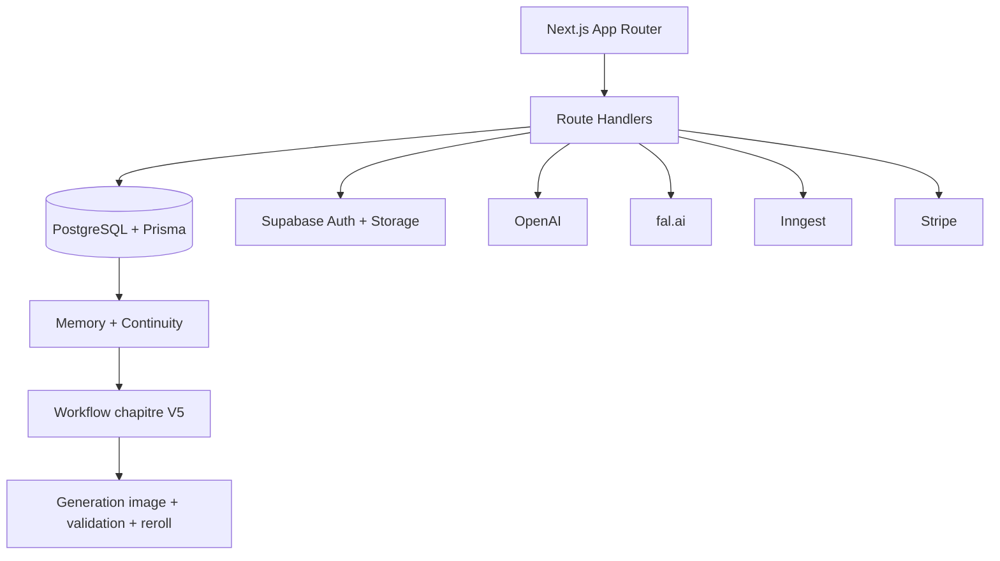
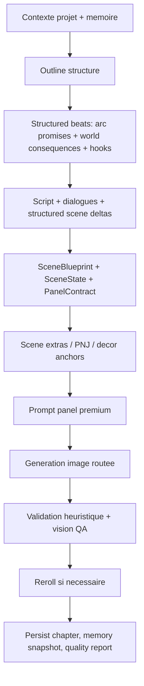

# Manga AI Studio

Source unique de verite du projet. Toute la documentation produit, architecture, deploiement, QA et etat du pipeline V5 est centralisee ici.

MYMANGA est un monorepo full-stack pour generer des chapitres manga/webtoon coherents avec :

- memoire narrative persistante
- personnages verrouilles par canon visuel
- generation d'images multi-provider
- SceneBlueprint, PanelContract, SceneState et continuity kernel
- QA premium, rerolls explicites et release gates
- lecteur manga + webtoon vertical

## Resume produit

Parcours principal :

1. creer un projet
2. definir personnages, style et univers
3. lancer un chapitre depuis une intention libre
4. lire en manga pagine ou en webtoon vertical
5. continuer la serie en gardant le canon

Fonctions cle actuelles :

- projets : pitch, genres, intensite, bible d'univers, style pack
- personnages : fiche complete, refs visuelles, preview, fingerprint, prompts verrouilles
- chapitres : outline structure, dialogues, continuity, storyboard, images, memoire
- PNJ/extras : generation procedurale, reusage scene-level et cross-scenes par lieu/projet
- images : fal en provider principal, retries explicites, proxy et URLs signees
- debug premium : fallbacks visibles, scores qualite, diagnostics panel/chapitre, routing FAL scene-first

## Architecture



Stack principale :

- frontend : Next.js 15, React 19, Tailwind v4, shadcn
- backend : route handlers Next.js + packages TypeScript
- data : PostgreSQL, Prisma, pgvector
- auth/storage : Supabase
- orchestration : Inngest avec fallback synchrone
- texte : OpenAI
- image : fal principal, Runware/BFL/Stability secondaires

## Structure du depot

```text
MYMANGA/
|-- apps/web/                  # app Next.js, UI et routes API
|-- packages/ai/              # prompts, image routing, QA vision, fingerprints
|-- packages/workflow/        # pipeline chapitre V5
|-- packages/world/           # SceneBlueprint, ontologies, QA procedurale
|-- packages/continuity/      # canon, snapshots, diff, validation
|-- packages/memory/          # RAG, scene extras, memoire persistante
|-- packages/core/            # types partages et contrats
|-- packages/db/              # schema Prisma
|-- packages/billing/         # Stripe, wallet, ledger
|-- packages/moderation/      # garde-fous contenu/provider
|-- render.yaml               # blueprint Render
`-- README.md                 # documentation unique
```

## Pipeline chapitre V5



Blocs premium actifs :

- `CharacterFingerprint` persiste sur les personnages et reinjecte dans les prompts
- `SceneState` et `PanelContract` sont construits avant image
- `SceneBlueprint` relie narration, environnement, style, cast et contraintes
- routing FAL scene-first avec `sceneComplexityScore`, `referencePolicy` et categories de panel
- outline structure avec `arcPromises`, `worldConsequences`, `setupPayoffHooks`
- dialogues produisent `sceneEvents`, `characterDeltas`, `locationDeltas`, `arcDeltas`
- `SceneExtrasRegistry` gere la recurrence des PNJ/extras
- release gate chapitre via `qualityReport`
- modes degrades et fallbacks explicitement traces

## Coherence narrative et visuelle

### Personnages

- refs canoniques via `CharacterVisualRef.isPrimary`
- extraction de fingerprint depuis donnees structurees et, si OpenAI est dispo, analyse vision des refs
- prompts panel/personnage avec contraintes de genre, couleurs, markers, drift interdit
- reroll si le panel rate la fidelite, le decor, le style ou l'interaction

### Monde et continuites

- StoryBible, WorldState, CharacterState, LocationState, EventLog, ArcRegistry
- snapshots et deltas apres validation
- continuity validator avant sortie finale
- scene extras persistants par scene et reusage cross-scenes/cross-chapitres base sur le lieu

### Storytelling

- beats avec role, tension, progression, turn, emotional delta
- dialogues alignes sur l'objectif du beat et les hooks amont
- anti-beats plats et anti-repetition
- consequences monde et setup/payoff maintenant remontes des l'outline

## Qualite premium et QA

### Release gates

Statuts normalises :

- `FULLY_OPERATIONAL`
- `DEGRADED_NO_OPENAI`
- `DEGRADED_NO_IMAGE_PROVIDER`
- `DEGRADED_STORAGE_MISSING`
- `DEGRADED_DIALOGUE_FALLBACK`
- `DEGRADED_OUTLINE_FALLBACK`

Le pipeline ne masque plus un fallback critique. Un chapitre degrade sort en `partial_success`.

### Scoring panel

Chaque panel peut etre note sur :

- `characterConsistencyScore`
- `backgroundPresenceScore`
- `environmentReadabilityScore`
- `interactionScore`
- `shotComplianceScore`
- `styleConsistencyScore`
- `releaseScore`
- `visionScore` si QA vision active

La validation panel combine :

- heuristiques prompt/metadata
- property validators du `SceneBlueprint`
- analyse vision reelle optionnelle via OpenAI sur les panels critiques ou ambigus

### Integration FAL scene-first

Le pipeline image n'est plus "portrait-first". Il applique maintenant :

- categories de panel : `ESTABLISHING_ENVIRONMENT`, `CHARACTER_IN_SCENE`, `CHARACTER_LOCK`, `LOCAL_FIX`
- reference policy progressive : `NONE`, `LIGHT`, `STRONG`
- tailles FAL centralisees : `character_ref`, `panel_story`, `panel_establishing`, `reroll_local`, `reroll_scene`
- passe scene-first sur les panels complexes : scene base puis renfort continuite personnage si utile
- rerolls cibles : decor, fidelite personnage, interaction, style, composition
- logs FAL structures : workflow, model, prompt final, negative constraints, taille, refs, reference policy, complexite
- benchmark FAL code-level pour archetypes de scene (`school_bullying`, `post_apo_establishing`, etc.)

### QA suites

Suites actuellement dans le code :

- fixed regression suite a 6 scenarios premium
- procedural stress suite par seeds
- property-based validation
- metamorphic tests pour changements controles

Scenarios fixes couverts :

1. exterieur post-apo avec heros seul
2. jardin romantique avec duo
3. ruelle cyberpunk avec PNJ
4. laboratoire abandonne avec creature
5. arene / scene d'action
6. close-up emotionnel

## Lecteur et UX

Le reader V5 supporte :

- manga pagine, simple ou double page
- webtoon vertical par defaut
- proxy image, URLs signees, retries d'images
- debug panel : provider, workflow, reference policy, complexite, rerolls, issues, findings vision
- bloc memoire + statut generation

Le webtoon a ete repoli pour :

- meilleure respiration verticale
- sections de page plus lisibles
- cases plus stables visuellement
- debug rendu directement visible dans le reader

## Admin et debug premium

Le backoffice expose maintenant :

- etat du stack de generation
- modes degrades actifs
- chapitres recents et release score
- panels faibles
- images bloquees ou en echec

Le reader expose aussi :

- quality report chapitre
- panel debug
- findings vision quand disponibles
- boutons debug de reroll force : decor / personnage / composition

## Providers et modeles

Etat actuel :

- image principale : fal.ai
- texte / continuity / embeddings / vision QA : OpenAI
- secondaires : Runware, BFL, Stability

Modele fal principal utilise pour les panels premium :

- `fal-ai/flux/dev`

Autres usages possibles selon routage et contexte :

- LoRA / Redux / refs selon complexite
- `fal-ai/flux-lora`
- `fal-ai/flux/dev/redux` pour les vrais cas `CHARACTER_LOCK`

## Installation locale

```bash
pnpm install
pnpm db:generate
pnpm db:push
pnpm dev
```

Commandes utiles :

| Commande | Role |
|---|---|
| `pnpm dev` | lance le site |
| `pnpm build` | build prod |
| `pnpm db:generate` | Prisma generate |
| `pnpm db:push` | sync schema |
| `pnpm db:studio` | Prisma Studio |
| `pnpm --filter @manga-ai-studio/ai test` | tests IA |
| `pnpm --filter @manga-ai-studio/workflow test` | tests workflow |
| `pnpm --filter @manga-ai-studio/world test` | tests QA world |
| `pnpm --filter @manga-ai-studio/web build` | build app web |

## Variables d'environnement

Variables critiques :

- `DATABASE_URL`
- `NEXT_PUBLIC_SUPABASE_URL`
- `NEXT_PUBLIC_SUPABASE_ANON_KEY`
- `SUPABASE_SERVICE_ROLE_KEY`
- `STORAGE_BUCKET`
- `FAL_KEY`
- `OPENAI_API_KEY`
- `STRIPE_SECRET_KEY`
- `STRIPE_WEBHOOK_SECRET`
- `NEXT_PUBLIC_APP_URL`
- `INNGEST_EVENT_KEY`
- `INNGEST_SIGNING_KEY`

Variables utiles / optionnelles :

- `BFL_API_KEY`
- `RUNWARE_API_KEY`
- `STABILITY_API_KEY`
- `ADMIN_UNLIMITED_EMAILS`
- `POSTHOG_KEY`
- `SENTRY_DSN`
- `OPENAI_VISION_MODEL`
- `ENABLE_PREMIUM_VISION_QA`
- `ENABLE_CHARACTER_VISION_FINGERPRINT`

Dev local minimal :

```env
AUTH_DISABLED=true
DATABASE_URL=postgresql://...
NEXT_PUBLIC_SUPABASE_URL=...
NEXT_PUBLIC_SUPABASE_ANON_KEY=...
```

Ne jamais laisser `AUTH_DISABLED=true` en production.

## Deploiement Render

Build command recommande :

```bash
npm install -g pnpm@10.33.0 && pnpm install --frozen-lockfile && pnpm --filter @manga-ai-studio/db exec prisma generate && pnpm --filter @manga-ai-studio/web build
```

Start command :

```bash
pnpm --filter @manga-ai-studio/web start
```

Checklist deploiement :

1. renseigner toutes les variables critiques
2. verifier `NEXT_PUBLIC_APP_URL`
3. ne pas definir `AUTH_DISABLED`
4. executer `pnpm --filter @manga-ai-studio/db exec prisma db push`
5. verifier `GET /api/diagnostics/public`
6. verifier `hasFalKey=true`, `hasOpenAI=true`, `authDisabled=false`
7. lancer un vrai chapitre test
8. confirmer que le job passe jusqu'a `update_memory`

Notes Render/Supabase :

- si Prisma echoue en local avec une erreur de connexion Supabase, verifier le bon host/port pooler
- si les images doivent etre persistantes, `SUPABASE_SERVICE_ROLE_KEY` + `STORAGE_BUCKET` sont necessaires
- le proxy image et les URLs signees sont la voie officielle en prod

## Base de donnees

Schema principal : `packages/db/prisma/schema.prisma`

Modeles notables :

- `Project`
- `Character`
- `Chapter`
- `ChapterScene`
- `SceneImage`
- `MemorySnapshot`
- `Job`
- `RagDocument`
- `Wallet`

## API principale

| Methode | Route | Role |
|---|---|---|
| `GET/POST` | `/api/projects` | projets |
| `GET/POST` | `/api/projects/[id]/characters` | personnages |
| `POST` | `/api/characters/[characterId]/generate-visual` | preview / visuel perso |
| `POST` | `/api/projects/[id]/chapters` | brouillon chapitre |
| `POST` | `/api/projects/[id]/pipeline` | lancer pipeline |
| `GET` | `/api/projects/[id]/chapters/[chapterId]` | data reader + debug |
| `POST` | `/api/projects/[id]/chapters/[chapterId]/continue` | suite chapitre |
| `POST` | `/api/scene-images/[sceneImageId]/retry` | reroll image (`?mode=environment|character|interaction|style|composition`) |
| `GET` | `/api/diagnostics/public` | checks prod sans secrets |

## Paiement et tokens

- Stripe alimente le wallet
- le wallet et le ledger sont la source de verite
- les comptes admin QA peuvent etre illimites

## Cout IA par chapitre

Ordre de grandeur pour un chapitre premium de 10 pages :

| Poste | Hypothese | Cout approx. |
|---|---|---|
| panels | 40-60 images `768x1024` via fal | `~0.58-0.95 USD` |
| style frame + keyframes + cover | refs et couverture | `~0.13 USD` |
| rerolls QA | decor / interaction / drift | `~0.03-0.10 USD` |
| texte + embeddings | outline, dialogues, passes, memoire | `~0.03-0.06 USD` |
| total | pipeline complet | `~0.77-1.24 USD` |

## Etat reel du projet

### Actif et robuste

- structure V5 premium branchee
- webtoon + manga reader fonctionnels
- chapitres avec diagnostics et release gates
- preview personnage + fingerprint + prompt lock
- outline et dialogues structures
- retries provider et fallbacks visibles
- docs consolidees dans ce README

### Encore perfectible mais non bloquant

- calibration fine des seuils de reroll sur gros corpus reel
- vision QA encore optionnelle et dependante d'OpenAI
- providers secondaires a valider davantage en prod
- export PDF encore simple
- TTS pas encore branche dans le reader

## Nettoyage de documentation

Ce README remplace les anciens fichiers disperses :

- changelogs dedies
- notes d'architecture separees
- guide de deploiement separe
- checklist legacy V4
- README secondaires frontend/backend/app

Objectif : une seule doc a maintenir, alignee avec le code reel.

## Raccourci mental

Si tu veux savoir "comment ca marche vraiment aujourd'hui", lis uniquement ce README et le pipeline dans `packages/workflow/src/run-full-chapter-pipeline.ts`.
