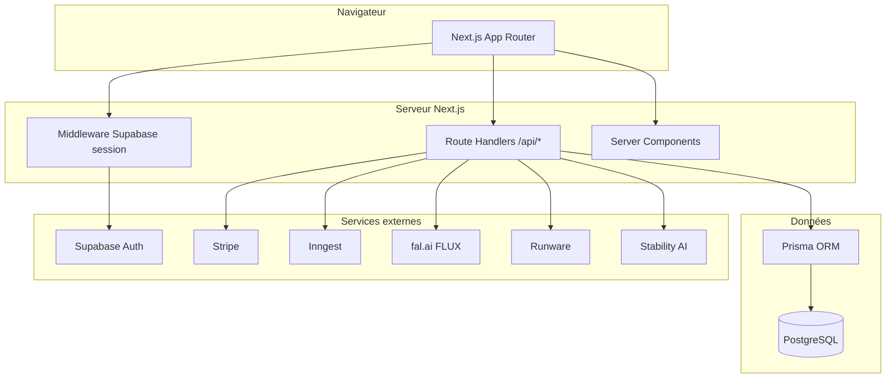

# Manga AI Studio

Plateforme web **studio IA** pour créer des séries **manga / webtoon / roman graphique** avec **mémoire narrative**, **direction artistique structurée** (style packs, canon packs) et **génération d’images multi-fournisseurs** (FLUX via fal, Runware, Stability, etc.).

Ce dépôt est un **monorepo** : site web Next.js, packages métier (IA, billing, modération, workflows) et schéma Prisma partagés.

> **Référence produit** : la spec à respecter est le document **Manga-ai-studio-master-spec.pdf** (master spec).

---

## Table des matières

1. [Ce que fait le produit](#ce-que-fait-le-produit)
2. [Architecture technique](#architecture-technique)
3. [Logiciels, services et IA utilisés](#logiciels-services-et-ia-utilisés)
4. [Comment ça tourne (flux de données)](#comment-ça-tourne-flux-de-données)
5. [Structure du dépôt](#structure-du-dépôt)
6. [Prérequis](#prérequis)
7. [Installation et exécution locale](#installation-et-exécution-locale)
8. [Variables d’environnement](#variables-denvironnement)
9. [Base de données (Prisma)](#base-de-données-prisma)
10. [API et authentification](#api-et-authentification)
11. [Paiement et tokens](#paiement-et-tokens)
12. [Orchestration (Inngest)](#orchestration-inngest)
13. [Tests](#tests)
14. [Déploiement](#déploiement)
15. [Feuille de route / limites connues](#feuille-de-route--limites-connues)

---

## Ce que fait le produit

- **Projets** : univers, pitch, genres, intensité de contenu (`ContentIntensityLayer`), notation `ContentRating`.
- **Personnages** : fiches + **Character Canon Pack** (références visuelles par slot : portrait, poses, expressions, etc.).
- **Style pack** : paramètres DA **canoniques** (famille de rendu, trait, ombrage, contraste, caméra, contraintes négatives, LoRAs approuvés) — moins de dépendance au seul « prompt libre ».
- **Bible d’univers** : JSON structuré (règles du monde, lore, thèmes) pour mémoire / futur RAG.
- **Chapitres** : brouillons, intention utilisateur, pipeline **manga-first** (canon → style → expressions → draft panels → inpaint → upscale → score cohérence) via Inngest.
- **Images** : **routage dynamique** vers le bon backend (fal / BFL / Runware / Stability) selon le mode de rendu, le contenu et les refs disponibles.
- **Modération** : matrice **intensité × fournisseur** + scan du **payload assemblé** (PromptComposer v2).
- **Monétisation web** : **Stripe** → crédit du **wallet** (ledger interne en tokens).
- **Wallet V3** : réservation, régularisation, refunds partiels, historique du ledger et idempotence Stripe côté webhook.
- **Lecteur manga (spec §19.4)** : pages construites depuis `storyboard` / `outline` + images de scènes ; **double page** (spread), navigation **Retour** / **Tourner la page**, bascule **texte seul** / **cases + texte**.
- **Suite de chapitre (spec §4.9)** : à la fin du feuilletage, carte **fin de chapitre** — instruction libre, suggestions et tags rapides → `POST .../chapters/[chapterId]/continue` crée le brouillon suivant et un job `GENERATE_CHAPTER_OUTLINE`.
- **Pipeline chapitre V3** : création d’un contexte projet, génération structurée `creativeDirection` / `plotOptions` / `outline` / `script` / `storyboard`, persistance scènes + panneaux, snapshot mémoire et timeline.
- **Admin & exports** : backoffice minimal, export chapitre, bible série, package projet, events de modération.

---

## Architecture technique



- **Frontend** : [Next.js 15](https://nextjs.org) (App Router), React 19, TypeScript strict, Tailwind CSS v4.
- **UI** : composants inspirés shadcn (Radix UI, `class-variance-authority`, `lucide-react`), utilitaire `cn` dans `@manga-ai-studio/ui`.
- **Backend dans l’app** : Route Handlers sous `apps/web/app/api/**` ; la logique métier riche vit dans `packages/*`.
- **Auth** : [Supabase Auth](https://supabase.com/docs/guides/auth) (magic link) + synchronisation vers la table `User` Prisma (`supabaseAuthId`). Mode développement possible sans Supabase via `AUTH_DISABLED=true`.
- **Persistance** : PostgreSQL + [Prisma](https://www.prisma.io).

---

## Logiciels, services et IA utilisés

| Catégorie | Technologie | Rôle dans le projet |
|-----------|-------------|---------------------|
| Runtime | **Node.js 20+** | Build et serveur Next.js |
| Gestionnaire de paquets | **pnpm** (workspaces) | Monorepo |
| Framework web | **Next.js** | UI, API, SSR/RSC |
| Langage | **TypeScript** | Typage strict |
| Styles | **Tailwind CSS** | Design system |
| Composants | **Radix UI**, **CVA** | Accessibilité, variants |
| Icônes | **lucide-react** | Iconographie |
| Base de données | **PostgreSQL** | Données applicatives |
| ORM | **Prisma** | Schéma, client, migrations (`db push` / futures migrations) |
| Auth | **Supabase** (`@supabase/ssr`, `@supabase/supabase-js`) | Sessions, magic link |
| Paiement | **Stripe** | Checkout packs de tokens, webhooks |
| Jobs async | **Inngest** | Pipeline chapitre / étapes longues |
| Validation | **Zod** | Entrées API, schémas env |
| Tests unitaires | **Vitest** | Routage image (`packages/ai`) |
| **IA image — principal stylisé** | **FLUX** via **[fal.ai](https://fal.ai)** | Appel HTTP `fal-ai/flux/schnell` si `FAL_KEY` est défini ([adapter](./packages/ai/src/adapters/fal-flux-adapter.ts)) |
| **IA image — contrôle / LoRA** | **Runware** (clé optionnelle) | Adapter stub / extension workflows Comfy-like |
| **IA image — BFL** | **Black Forest Labs** (clé optionnelle) | Adapter stub |
| **IA image — fallback réaliste** | **Stability** (Stable Image Ultra, clé optionnelle) | Adapter stub, routage cover photoreal |
| **IA texte** (prévu / extension) | **OpenAI** ou autre via `OPENAI_API_KEY` | PromptComposer v2 structuré, agents chapitre |
| Hébergement (doc) | **Render** | `render.yaml` + [DEPLOYMENT.md](./DEPLOYMENT.md) |

Sans clés API image, les **adapters** retournent des **images placeholder** (mock) pour le développement.

---

## Comment ça tourne (flux de données)

### 1. Connexion utilisateur

1. L’utilisateur demande un **magic link** sur `/login` (client Supabase).
2. Après clic dans l’e-mail, redirection vers `/auth/callback` qui échange le code contre une **session** (cookies).
3. Le **middleware** rafraîchit la session Supabase sur les requêtes concernées.
4. Les pages sous `(app)/` appellent `getCurrentUser()` : création ou mise à jour du **`User` Prisma** (email, `supabaseAuthId`, wallet initial si besoin).

### 2. Projet et DA

- Création d’un projet via `POST /api/projects` : crée aussi un **StylePack** v1 par défaut.
- Édition DA : `PUT /api/projects/:id/style-pack` (enums Prisma : `RenderFamily`, `LineWeight`, etc.).
- Personnages : `POST /api/projects/:id/characters` avec création du **canon pack** associé.

### 3. Estimation et génération d’image

1. **`POST /api/estimate-image`** : calcule une **`ImageRoutingDecision`** (provider, modèle, workflow, raison) + **coût tokens** estimé (voir `packages/billing/src/pricing.ts`).
2. **`POST /api/ai/generate`** :
   - Vérifie l’utilisateur et le **routage** (modération / blocage éventuel).
   - **Réserve / débite** les tokens via le wallet (`packages/billing`).
   - Appelle **`runRoutedImageGeneration`** (`packages/ai`) qui sélectionne l’adapter et exécute la génération.

La logique de routage est centralisée dans **`decideImageRoute`** (`packages/ai/src/image-routing-service.ts`), avec règles alignées sur la spec produit (inpaint, multi-ref, cover photoreal → Stability, etc.).

### 4. Pipeline chapitre (Inngest)

- **`POST /api/projects/:id/pipeline`** avec `chapterId` envoie l’événement `chapter/generate.requested` à Inngest (si `INNGEST_EVENT_KEY` est défini).
- La fonction **`generateChapterPipeline`** (`packages/workflow/src/functions.ts`) enchaîne des étapes logiques (outline, script, storyboard, puis étapes DA manga-first). Les étapes peuvent être enrichies pour appeler de vrais jobs LLM / image.
- **`POST .../chapters/[chapterId]/continue`** : après lecture, enregistre l’intention de suite et crée un job **`GENERATE_CHAPTER_OUTLINE`** sur le nouveau chapitre — à traiter dans le worker Inngest quand tu branches la génération texte.

### 5. Paiement Stripe

- **`POST /api/billing/checkout-session`** : session Checkout Stripe avec métadonnées `userId`, `packCode`, `tokensGranted`.
- **`POST /api/billing/webhooks/stripe`** : sur `checkout.session.completed`, crédit du wallet via **`creditPurchase`** (ledger).

---

## Structure du dépôt

```
MYMANGA/
├── apps/web/                 # Site web Next.js (UI + API routes)
├── packages/
│   ├── ai/                   # Routage image, adapters fal/BFL/Runware/Stability, PromptComposer v2
│   ├── billing/              # Stripe checkout, wallet, pricing par mode/provider
│   ├── config/               # Schéma Zod des variables d’environnement
│   ├── core/                 # Modes de rendu, cohérence prod, **pages lecteur manga** (`manga-reader-pages.ts`)
│   ├── db/                   # Prisma schema + client exporté
│   ├── exports/              # Stubs export PDF/ZIP
│   ├── memory/               # Stubs RAG / indexation
│   ├── moderation/           # Intensité contenu, matrice fournisseur, garde-fous payload
│   ├── prompts/              # Prompts système (texte)
│   ├── ui/                   # Utilitaire cn (Tailwind merge)
│   └── workflow/             # Client Inngest + fonctions + envoi d’événements
├── .env.example
├── DEPLOYMENT.md             # Guide Render, Supabase, Stripe, IA
├── render.yaml               # Blueprint Render (à adapter)
├── package.json              # Scripts racine
└── pnpm-workspace.yaml
```

---

## Prérequis

- **Node.js** ≥ 20
- **pnpm** 10+ (le repo définit `packageManager` dans `package.json`)
- **PostgreSQL** accessible (local, Docker, Supabase, Neon, Render Postgres, etc.)

---

## Installation et exécution locale

```bash
# À la racine du monorepo
pnpm install

# Générer le client Prisma
pnpm db:generate

# Appliquer le schéma à la base (dev)
pnpm db:push

# (Optionnel) données de démo pricing
pnpm db:seed

# Lancer l’app web (http://localhost:3000)
pnpm dev
```

Scripts utiles définis à la racine :

| Commande | Description |
|----------|-------------|
| `pnpm dev` | Démarre `apps/web` en mode développement |
| `pnpm build` | Build production Next.js |
| `pnpm db:generate` | `prisma generate` |
| `pnpm db:push` | `prisma db push` |
| `pnpm db:studio` | Prisma Studio |
| `pnpm db:seed` | Seed des règles de pricing |
| `pnpm test` | Tests Vitest du package `ai` |

---

## Variables d’environnement

Copie [`.env.example`](./.env.example) vers `apps/web/.env.local` (ou `.env` selon ton habitude) **et** assure-toi que Prisma lit `DATABASE_URL` (souvent même fichier ou lien symbolique).

Les variables critiques :

- **`DATABASE_URL`** : connexion PostgreSQL
- **`NEXT_PUBLIC_SUPABASE_URL`**, **`NEXT_PUBLIC_SUPABASE_ANON_KEY`** : auth (production)
- **`AUTH_DISABLED=true`** : uniquement en local pour skipper Supabase (ne jamais activer en prod)
- **`NEXT_PUBLIC_APP_URL`** : URL publique (Stripe redirects, e-mails)
- **`STRIPE_SECRET_KEY`**, **`STRIPE_WEBHOOK_SECRET`**
- **`NEXT_PUBLIC_STRIPE_PUBLISHABLE_KEY`**, **`RESEND_API_KEY`**
- **`INNGEST_EVENT_KEY`**, **`INNGEST_SIGNING_KEY`**
- **`FAL_KEY`**, **`BFL_API_KEY`**, **`RUNWARE_API_KEY`**, **`STABILITY_API_KEY`**, **`OPENAI_API_KEY`** : selon les fournisseurs activés
- **`POSTHOG_KEY`**, **`SENTRY_DSN`**, **`STORAGE_BUCKET`** : analytics / observabilité / assets

Détail et procédures cloud : **[DEPLOYMENT.md](./DEPLOYMENT.md)**.

---

## Base de données (Prisma)

- Schéma : [`packages/db/prisma/schema.prisma`](./packages/db/prisma/schema.prisma)
- Modèles notables : `User`, `Project`, `StylePack`, `Character`, `CharacterCanonPack`, `CanonPackAsset`, `LoraModel`, `LoraAttachment`, `Chapter`, `SceneImage` (modes de rendu, routing JSON, score cohérence), `Wallet`, `WalletTransaction`, `Job`, etc.

Après modification du schéma :

```bash
pnpm db:generate
pnpm db:push
```

---

## API et authentification

Les routes sous `apps/web/app/api/**` utilisent en général **`getAppUser()`** : retourne `null` si non connecté → réponse **401**.

Principales routes :

| Méthode | Chemin | Rôle |
|---------|--------|------|
| `GET`/`POST` | `/api/projects` | Liste / création projets |
| `GET`/`PATCH`/`DELETE` | `/api/projects/[id]` | Détail / mise à jour / archivage |
| `GET`/`POST` | `/api/projects/[id]/characters` | Personnages |
| `GET`/`PATCH`/`DELETE` | `/api/characters/[characterId]` | Fiche personnage détaillée |
| `POST` | `/api/characters/[characterId]/generate-visual` | Génération de référence visuelle |
| `GET`/`PUT` | `/api/projects/[id]/style-pack` | Style pack |
| `PUT` | `/api/projects/[id]/bible` | Bible |
| `GET`/`POST` | `/api/projects/[id]/relationships` | Matrice de relations |
| `GET`/`POST` | `/api/projects/[id]/arcs` | Arcs narratifs |
| `GET`/`POST` | `/api/projects/[id]/chapters` | Chapitres |
| `POST` | `/api/projects/[id]/chapters/estimate` | Estimation V3 + preview mémoire |
| `GET`/`PATCH` | `/api/projects/[id]/chapters/[chapterId]` | Détail chapitre (scènes + images) / mise à jour partielle |
| `POST` | `/api/projects/[id]/chapters/[chapterId]/continue` | Suite utilisateur → nouveau chapitre brouillon + job outline |
| `POST` | `/api/projects/[id]/pipeline` | Enqueue Inngest |
| `POST` | `/api/estimate-image` | Routing + coût tokens |
| `POST` | `/api/ai/generate` | Génération image (débit wallet) |
| `GET` | `/api/wallet` | Solde + dernières transactions |
| `GET` | `/api/wallet/transactions` | Ledger wallet |
| `POST` | `/api/billing/checkout-session` | Stripe Checkout |
| `POST` | `/api/billing/webhooks/stripe` | Webhook Stripe |
| `GET` | `/api/jobs/[jobId]` | Suivi d’un job |
| `POST` | `/api/jobs/[jobId]/cancel` | Annulation |
| `GET` | `/api/account/me` | Profil / préférences |
| `POST` | `/api/account/age-gate` | Vérification d’âge |
| `GET` | `/api/moderation/events` | Historique modération |
| `POST` | `/api/moderation/review-request` | Demande de revue |
| `POST` | `/api/chapters/[chapterId]/export/pdf` | Export chapitre |
| `POST` | `/api/projects/[id]/export/bible` | Export bible |
| `POST` | `/api/projects/[id]/export/package` | Export package |
| `GET`/`POST`/`PUT` | `/api/inngest` | Handler Inngest |

---

## Paiement et tokens

- Les **tokens** sont une unité métier ; le **wallet** et les **transactions** sont la source de vérité (pas un simple compteur flottant).
- Les **prix** par mode de rendu et multiplicateur par **provider** sont dans `packages/billing/src/pricing.ts`.
- L’achat Stripe crédite le wallet ; la génération image **débite** via `reserveTokens` (à terme : politique de remboursement si échec API à durcir).

---

## Orchestration (Inngest)

- **Développement** : [Inngest Dev Server](https://www.inngest.com/docs/local-development) ou compte cloud avec l’URL de l’app pointant vers `/api/inngest`.
- **Événements** :
  - `chapter/generate.requested` — pipeline manga-first ; la première étape **génère réellement l’outline** (LLM si `OPENAI_API_KEY`, sinon gabarit local) et met à jour le chapitre.
  - `chapter/outline.job.requested` — traitement du job Prisma `GENERATE_CHAPTER_OUTLINE` après une **suite** utilisateur (`POST .../continue`). Sans `INNGEST_EVENT_KEY`, la même logique s’exécute **de façon synchrone** dans la route API.

---

## Tests

```bash
pnpm test
```

Couvre notamment le **routage image** (`packages/ai/src/image-routing-service.test.ts`). À étendre avec tests d’intégration API et E2E (Playwright) pour les parcours critiques.

---

## Déploiement

- Guide pas à pas : **[DEPLOYMENT.md](./DEPLOYMENT.md)**
- Exemple Blueprint : **[render.yaml](./render.yaml)**

---

## Feuille de route / limites connues

- **Exports** : implémentation utilitaire en texte/binaire simple ; remplacer par vrai moteur PDF/ZIP si tu veux une prod premium.
- **Adapters Runware / BFL / Stability** : stubs ou partiels — à brancher sur les APIs officielles pour la prod.
- **RAG / pgvector** : retrieval textuel et snapshots mémoire en place ; embeddings pgvector encore à brancher.
- **Rate limiting** : helper léger en mémoire présent ; Upstash reste à brancher pour une prod multi-instances.
- **OpenAI / agents texte** : pipeline déterministe structuré en place ; encore à densifier avec structured outputs multi-agents si tu veux dépasser le fallback industriel actuel.

---

## Licence et contribution

Projet privé / produit — adapte la licence selon ta stratégie. Pour contribuer : respecter la séparation **domaine** (`packages/core`, `packages/ai`, …) vs **transport** (`apps/web/app/api`).

---

*README du site web Manga AI Studio — stack et flux alignés sur la spec produit multi-provider et DA canon-first.*
